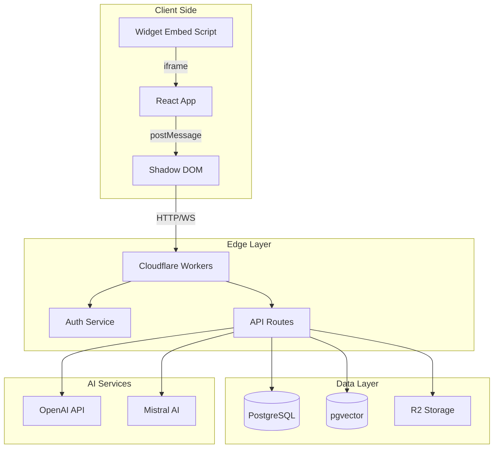

# System Architecture Overview

## 🏗️ High-Level Architecture

The Websyte AI Chat Widget is a full-stack application built for embedding intelligent chat assistants on any website. It combines modern web technologies with AI capabilities to provide a seamless chat experience.



## 🛠️ Technology Stack

### Frontend
- **Framework**: React 18 with React Router 7
- **Build Tool**: Vite 6
- **Styling**: Tailwind CSS v4 with CSS variables
- **UI Components**: shadcn/ui (New York style, zinc theme)
- **State Management**: React Context + custom hooks
- **Widget Isolation**: Shadow DOM + iframe embedding

### Backend
- **Runtime**: Cloudflare Workers (Edge computing)
- **Framework**: Hono (lightweight web framework)
- **Language**: TypeScript (strict mode)
- **API Design**: RESTful with streaming support

### Database
- **Primary**: Neon PostgreSQL (serverless)
- **ORM**: Drizzle ORM with full TypeScript support
- **Vector Search**: pgvector extension for embeddings
- **File Storage**: Cloudflare R2 (S3-compatible)

### AI/ML Stack
- **Chat Model**: OpenAI GPT-4o-mini
- **Embeddings**: OpenAI text-embedding-3-small (1536 dimensions)
- **OCR**: Mistral AI for document processing
- **RAG**: Custom implementation with vector similarity search

### Authentication
- **User Auth**: Better Auth with session management
- **OAuth**: Google provider support
- **API Auth**: Bearer token for automation
- **Public Access**: Anonymous widget access

### Infrastructure
- **Hosting**: Cloudflare Workers (global edge network)
- **CDN**: Cloudflare CDN for static assets
- **Monitoring**: Cloudflare Analytics
- **Secrets**: Cloudflare Workers Secrets

## 📁 Project Structure

```
websyte-ai-chat-widget/
├── app/                    # React frontend application
│   ├── components/        # UI components
│   │   ├── ui/           # shadcn/ui components
│   │   ├── ChatWidget/   # Main chat widget
│   │   ├── blocks/       # Landing page blocks
│   │   └── landing-chat/ # Landing components
│   ├── routes/           # React Router pages
│   ├── lib/              # Utilities and helpers
│   └── widget-entry.tsx  # Widget embed entry point
├── workers/              # Backend Cloudflare Workers
│   ├── routes/          # Modular API routes
│   ├── services/        # Business logic services
│   ├── lib/             # Shared utilities
│   ├── db/              # Database schemas
│   └── app.ts           # Main worker entry
├── test/                # Test suites
│   ├── unit/           # Unit tests
│   └── integration/    # Integration tests
├── public/             # Static assets
└── .claude/            # Documentation
```

## 🔄 Data Flow Architecture

### 1. Widget Initialization
```
User Website → Embed Script → Widget Bundle → React App → Shadow DOM
```

### 2. Chat Message Flow
```
User Input → Widget → API → Auth Check → RAG Pipeline → OpenAI → Response
                                ↓
                            Message Storage
```

### 3. Content Processing
```
Document Upload → OCR Service → Text Extraction → Chunking → Embeddings → Vector DB
```

### 4. RAG Query Flow
```
User Query → Embedding → Vector Search → Context Retrieval → LLM Prompt → Response
```

## 🏛️ Architectural Patterns

### Frontend Patterns
- **Component Composition**: Small, focused components
- **Custom Hooks**: Business logic separation
- **Context Providers**: Global state management
- **Error Boundaries**: Graceful error handling

### Backend Patterns
- **Service Layer**: Clear business logic separation
- **Middleware Stack**: Auth, CORS, rate limiting
- **Repository Pattern**: Database abstraction
- **Factory Pattern**: Service instantiation

### Data Patterns
- **Event Sourcing**: Message history tracking
- **CQRS**: Separate read/write operations
- **Vector Indexing**: Semantic search optimization
- **Caching Strategy**: Multi-level caching

## 🚀 Key Features

### Core Capabilities
- **Intelligent Chat**: Context-aware AI responses
- **RAG System**: Knowledge base integration
- **Multi-Format Support**: Text, PDF, web crawling
- **Real-Time Streaming**: Server-sent events
- **Offline Support**: LocalStorage fallback

### Advanced Features
- **Custom Branding**: Theming and styling
- **Analytics**: Usage tracking and insights
- **Automation API**: Programmatic access
- **Multi-Language**: i18n support (planned)
- **Voice Support**: Audio transcription

## 🔒 Security Architecture

### Authentication Layers
1. **Session Auth**: Cookie-based for web users
2. **Bearer Token**: For API automation
3. **Public Access**: Anonymous widget usage
4. **Admin Roles**: Privileged operations

### Security Features
- **Rate Limiting**: Per-user and IP-based
- **CORS Policy**: Strict origin validation
- **CSP Headers**: Content security policy
- **Input Validation**: Server-side sanitization
- **Encryption**: TLS for all communications

## 📈 Performance Optimizations

### Frontend
- **Code Splitting**: Lazy loading of components
- **Bundle Optimization**: ~200KB production build
- **Shadow DOM**: Style isolation without overhead
- **Virtual Scrolling**: For long message lists

### Backend
- **Edge Computing**: <50ms latency globally
- **Content Caching**: 70-80% cache hit rate
- **Connection Pooling**: Database optimization
- **Streaming Responses**: Reduced time-to-first-byte

### Data Layer
- **Vector Indexing**: IVFFlat for fast similarity search
- **Query Optimization**: Prepared statements
- **Batch Operations**: Bulk embedding creation
- **Compression**: R2 storage optimization

## 🔍 Monitoring & Observability

### Metrics
- **API Latency**: Response time tracking
- **Error Rates**: Failed request monitoring
- **Cache Performance**: Hit/miss ratios
- **User Activity**: Engagement metrics

### Logging
- **Structured Logs**: JSON formatted
- **Request Tracing**: Correlation IDs
- **Error Context**: Stack traces and metadata
- **Audit Trail**: Security-relevant events

## 🎯 Design Goals

### Primary Goals
1. **Developer Experience**: Easy integration and customization
2. **User Experience**: Fast, intuitive chat interface
3. **Scalability**: Handle millions of messages
4. **Reliability**: 99.9% uptime target
5. **Security**: Enterprise-grade protection

### Non-Functional Requirements
- **Performance**: <200ms API response time
- **Availability**: Multi-region deployment
- **Maintainability**: Modular, testable code
- **Extensibility**: Plugin architecture (future)
- **Compliance**: GDPR, SOC2 ready

---

For detailed implementation specifics, see:
- [Frontend Architecture](./FRONTEND.md)
- [Backend Architecture](./BACKEND.md)
- [Database Schema](./DATABASE.md)
- [Deployment Guide](./DEPLOYMENT.md)