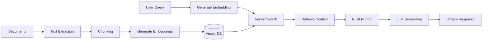

# RAG Pipeline Architecture

## 🧠 Overview

The Retrieval-Augmented Generation (RAG) pipeline combines vector search with Large Language Models to provide context-aware, accurate responses based on uploaded documents and crawled content.

## 🔄 RAG Processing Flow



## 🏗️ Core Components

### RAG Agent Service (`workers/services/rag-agent.service.ts`)

The main orchestrator for RAG operations:

```typescript
export class RAGAgent {
  constructor(
    private openai: OpenAI,
    private db: NeonHttpDatabase<typeof schema>,
    private vectorSearch: VectorSearchService
  ) {}

  async generateResponse(
    request: ChatRequest,
    userId: string,
    options?: RAGOptions
  ): Promise<RAGResponse> {
    // 1. Retrieve relevant context
    const context = await this.retrieveRelevantContext(
      request.message,
      request.widgetId,
      userId,
      options?.maxChunks || 5,
      options?.threshold || 0.7
    );

    // 2. Build system prompt with context
    const systemPrompt = this.buildSystemPrompt(
      context.chunks,
      request.additionalContext,
      options?.systemInstructions
    );

    // 3. Generate response with streaming
    const completion = await this.openai.chat.completions.create({
      model: options?.model || 'gpt-4o-mini',
      messages: [
        { role: 'system', content: systemPrompt },
        ...request.history || [],
        { role: 'user', content: request.message }
      ],
      stream: true,
      temperature: options?.temperature || 0.7,
      max_tokens: options?.maxTokens || 2000
    });

    return {
      stream: completion,
      sources: context.sources,
      chunks: context.chunks
    };
  }
}
```

### Context Retrieval

```typescript
private async retrieveRelevantContext(
  query: string,
  widgetId: string,
  userId: string,
  maxChunks: number,
  threshold: number
): Promise<RetrievalContext> {
  // Check widget access permissions
  const hasAccess = await this.checkWidgetAccess(widgetId, userId);
  if (!hasAccess) {
    throw new Error('Access denied to widget');
  }

  // Perform vector similarity search
  const searchResults = await this.vectorSearch.searchSimilarContent(
    query,
    widgetId,
    maxChunks * 2, // Fetch more for filtering
    threshold
  );

  // Deduplicate and rank results
  const rankedChunks = this.rankAndDeduplicate(searchResults);

  // Extract source information
  const sources = this.extractSources(rankedChunks);

  return {
    chunks: rankedChunks.slice(0, maxChunks),
    sources: sources,
    totalMatches: searchResults.length
  };
}
```

### Prompt Engineering

```typescript
private buildSystemPrompt(
  chunks: RetrievedChunk[],
  additionalContext?: string,
  customInstructions?: string
): string {
  const contextSection = chunks.length > 0
    ? `Here is relevant information from the knowledge base:\n\n${
        chunks.map((chunk, i) => 
          `[Source ${i + 1}]: ${chunk.metadata?.fileName || 'Unknown'}\n${chunk.content}\n`
        ).join('\n---\n')
      }`
    : 'No specific context found in the knowledge base.';

  return `You are an AI assistant with access to a knowledge base.

${customInstructions || 'Answer questions accurately based on the provided context.'}

${additionalContext ? `Additional Context: ${additionalContext}\n` : ''}

${contextSection}

Important instructions:
- Base your answers on the provided context when available
- If the context doesn't contain relevant information, say so
- Be concise but comprehensive
- Cite sources when referencing specific information
- Maintain a helpful and professional tone`;
}
```

## 📊 Vector Search Service

### Embedding Generation

```typescript
export class VectorSearchService {
  private embeddingCache = new Map<string, number[]>();

  async generateEmbedding(text: string): Promise<number[]> {
    // Check cache first
    const cacheKey = this.getCacheKey(text);
    if (this.embeddingCache.has(cacheKey)) {
      return this.embeddingCache.get(cacheKey)!;
    }

    // Generate new embedding
    const response = await this.openai.embeddings.create({
      model: 'text-embedding-3-small',
      input: text,
      dimensions: 1536
    });

    const embedding = response.data[0].embedding;
    
    // Cache for reuse
    this.embeddingCache.set(cacheKey, embedding);
    
    return embedding;
  }
}
```

### Similarity Search

```typescript
async searchSimilarContent(
  query: string,
  widgetId?: string,
  limit = 10,
  threshold = 0.7
): Promise<SearchResult[]> {
  // Generate query embedding
  const queryEmbedding = await this.generateEmbedding(query);

  // Perform cosine similarity search using pgvector
  const results = await this.db
    .select({
      id: embeddings.id,
      content: embeddings.contentChunk,
      fileId: embeddings.fileId,
      similarity: sql`1 - (${embeddings.embedding} <=> ${queryEmbedding})`,
      metadata: embeddings.metadata,
    })
    .from(embeddings)
    .leftJoin(widgetFiles, eq(embeddings.fileId, widgetFiles.id))
    .where(and(
      widgetId ? eq(embeddings.widgetId, widgetId) : undefined,
      sql`${embeddings.embedding} <=> ${queryEmbedding} < ${1 - threshold}`
    ))
    .orderBy(sql`${embeddings.embedding} <=> ${queryEmbedding}`)
    .limit(limit);

  return results.map(r => ({
    ...r,
    score: r.similarity,
    fileName: r.widget_file?.fileName,
    fileUrl: r.widget_file?.fileUrl
  }));
}
```

## 🔪 Text Processing

### Content Chunking Strategy

```typescript
export async function chunkText(
  text: string,
  options: ChunkOptions = {}
): Promise<TextChunk[]> {
  const {
    maxWords = 2000,
    overlapWords = 100,
    chunkingStrategy = 'semantic'
  } = options;

  if (chunkingStrategy === 'semantic') {
    return this.semanticChunking(text, maxWords, overlapWords);
  }

  // Default sliding window approach
  const words = text.split(/\s+/);
  const chunks: TextChunk[] = [];
  
  for (let i = 0; i < words.length; i += maxWords - overlapWords) {
    const chunkWords = words.slice(i, i + maxWords);
    const chunkText = chunkWords.join(' ');
    
    chunks.push({
      text: chunkText,
      startOffset: i,
      endOffset: Math.min(i + maxWords, words.length),
      wordCount: chunkWords.length,
      metadata: {
        chunkIndex: chunks.length,
        hasOverlap: i > 0
      }
    });
  }

  return chunks;
}
```

### Semantic Chunking

```typescript
private semanticChunking(
  text: string,
  maxWords: number,
  overlapWords: number
): TextChunk[] {
  // Split by natural boundaries
  const sections = this.splitBySections(text);
  const chunks: TextChunk[] = [];

  for (const section of sections) {
    if (section.wordCount <= maxWords) {
      // Small enough to be a single chunk
      chunks.push({
        text: section.text,
        startOffset: section.startOffset,
        endOffset: section.endOffset,
        wordCount: section.wordCount,
        metadata: {
          sectionTitle: section.title,
          chunkIndex: chunks.length
        }
      });
    } else {
      // Split large sections with overlap
      const sectionChunks = this.splitWithOverlap(
        section.text,
        maxWords,
        overlapWords
      );
      chunks.push(...sectionChunks);
    }
  }

  return chunks;
}
```

## 🚀 Document Processing Pipeline

### File Upload Flow

```typescript
export class DocumentProcessor {
  async processUploadedFile(
    file: File,
    widgetId: string,
    fileId: string
  ): Promise<ProcessingResult> {
    try {
      // 1. Extract text based on file type
      const extractedText = await this.extractText(file);

      // 2. Clean and normalize text
      const cleanedText = this.cleanText(extractedText);

      // 3. Chunk the text
      const chunks = await this.chunkText(cleanedText, {
        maxWords: 2000,
        overlapWords: 100
      });

      // 4. Generate embeddings for each chunk
      const embeddingPromises = chunks.map(chunk =>
        this.vectorSearch.generateEmbedding(chunk.text)
      );
      const embeddings = await Promise.all(embeddingPromises);

      // 5. Store in database
      await this.storeEmbeddings(
        widgetId,
        fileId,
        chunks,
        embeddings,
        file.name
      );

      return {
        success: true,
        chunksCreated: chunks.length,
        fileName: file.name
      };
    } catch (error) {
      console.error('Document processing error:', error);
      throw error;
    }
  }
}
```

### Text Extraction

```typescript
private async extractText(file: File): Promise<string> {
  const mimeType = file.type;

  switch (mimeType) {
    case 'text/plain':
    case 'text/markdown':
    case 'text/csv':
      return await file.text();

    case 'application/pdf':
      return await this.extractPdfText(file);

    case 'application/vnd.openxmlformats-officedocument.wordprocessingml.document':
      return await this.extractDocxText(file);

    case 'application/json':
      const json = await file.text();
      return JSON.stringify(JSON.parse(json), null, 2);

    default:
      // Use OCR for images and unsupported formats
      if (mimeType.startsWith('image/')) {
        return await this.ocrService.extractText(file);
      }
      throw new Error(`Unsupported file type: ${mimeType}`);
  }
}
```

## 🎯 Ranking and Relevance

### Result Ranking Algorithm

```typescript
private rankAndDeduplicate(
  results: SearchResult[]
): RankedChunk[] {
  // Group by content similarity to avoid duplicates
  const groups = this.groupSimilarChunks(results);

  // Score each group
  const scoredGroups = groups.map(group => {
    const bestChunk = group[0]; // Highest similarity
    const diversityBonus = group.length > 1 ? 0.05 : 0;
    
    return {
      ...bestChunk,
      finalScore: bestChunk.score + diversityBonus,
      alternativeChunks: group.slice(1)
    };
  });

  // Sort by final score
  return scoredGroups
    .sort((a, b) => b.finalScore - a.finalScore)
    .map(({ alternativeChunks, ...chunk }) => chunk);
}
```

### Content Deduplication

```typescript
private groupSimilarChunks(
  chunks: SearchResult[],
  similarityThreshold = 0.9
): SearchResult[][] {
  const groups: SearchResult[][] = [];
  const processed = new Set<string>();

  for (const chunk of chunks) {
    if (processed.has(chunk.id)) continue;

    const group = [chunk];
    processed.add(chunk.id);

    // Find similar chunks
    for (const other of chunks) {
      if (processed.has(other.id)) continue;

      const similarity = this.calculateTextSimilarity(
        chunk.content,
        other.content
      );

      if (similarity > similarityThreshold) {
        group.push(other);
        processed.add(other.id);
      }
    }

    groups.push(group);
  }

  return groups;
}
```

## 📈 Performance Optimization

### Embedding Cache

```typescript
export class EmbeddingCache {
  private cache: LRUCache<string, number[]>;
  private persistentStore: KVNamespace;

  constructor(maxSize = 1000) {
    this.cache = new LRUCache({ max: maxSize });
  }

  async get(text: string): Promise<number[] | null> {
    const key = this.getKey(text);
    
    // Check memory cache
    const cached = this.cache.get(key);
    if (cached) return cached;

    // Check persistent store
    const stored = await this.persistentStore.get(key, 'json');
    if (stored) {
      this.cache.set(key, stored);
      return stored;
    }

    return null;
  }

  async set(text: string, embedding: number[]): Promise<void> {
    const key = this.getKey(text);
    
    // Store in both caches
    this.cache.set(key, embedding);
    await this.persistentStore.put(
      key,
      JSON.stringify(embedding),
      { expirationTtl: 86400 * 30 } // 30 days
    );
  }
}
```

### Batch Processing

```typescript
async createEmbeddingsForWidget(
  widgetId: string,
  chunks: TextChunk[],
  fileId: string
): Promise<void> {
  const BATCH_SIZE = 20;
  
  for (let i = 0; i < chunks.length; i += BATCH_SIZE) {
    const batch = chunks.slice(i, i + BATCH_SIZE);
    
    // Generate embeddings in parallel
    const embeddings = await Promise.all(
      batch.map(chunk => this.generateEmbedding(chunk.text))
    );
    
    // Batch insert to database
    const records = batch.map((chunk, idx) => ({
      widgetId,
      fileId,
      contentChunk: chunk.text,
      embedding: embeddings[idx],
      metadata: {
        chunkIndex: i + idx,
        totalChunks: chunks.length,
        ...chunk.metadata
      }
    }));
    
    await this.db.insert(embeddings).values(records);
    
    // Progress callback
    if (this.onProgress) {
      this.onProgress({
        processed: Math.min(i + BATCH_SIZE, chunks.length),
        total: chunks.length
      });
    }
  }
}
```

## 🔍 Quality Assurance

### Response Validation

```typescript
export class ResponseValidator {
  validateRAGResponse(
    response: string,
    context: RetrievedChunk[],
    query: string
  ): ValidationResult {
    const checks = {
      hasContent: response.length > 0,
      notTooShort: response.length > 50,
      notTooLong: response.length < 4000,
      relevantToQuery: this.checkRelevance(response, query),
      citedSources: this.checkSourceCitation(response, context),
      noHallucination: this.checkFactualAccuracy(response, context)
    };

    const issues = Object.entries(checks)
      .filter(([, passed]) => !passed)
      .map(([check]) => check);

    return {
      valid: issues.length === 0,
      issues,
      confidence: this.calculateConfidence(checks)
    };
  }
}
```

## 💡 Complete Integration Example

### Setting Up RAG for a Widget

```typescript
// 1. Create widget with RAG configuration
const widget = await widgetService.create({
  name: 'Documentation Assistant',
  userId: 'user-123',
  widgetType: 'custom',
  ragConfig: {
    model: 'gpt-4o-mini',
    temperature: 0.7,
    maxTokens: 2000,
    topK: 5,
    similarityThreshold: 0.7,
    systemPrompt: 'You are a helpful documentation assistant...'
  }
});

// 2. Upload documents for knowledge base
const files = [
  { name: 'user-guide.pdf', content: pdfBuffer },
  { name: 'api-reference.md', content: markdownContent }
];

for (const file of files) {
  // Upload to R2
  const fileKey = await r2Service.upload(file.content, {
    widgetId: widget.id,
    fileName: file.name
  });
  
  // Process with workflow
  await workflowService.startContentPipeline({
    widgetId: widget.id,
    source: 'upload',
    fileKeys: [fileKey]
  });
}

// 3. Start website crawl for additional content
await crawlService.startCrawl({
  widgetId: widget.id,
  startUrl: 'https://docs.example.com',
  maxPages: 100,
  includePaths: ['/guide/', '/api/'],
  excludePaths: ['/blog/', '/changelog/']
});

// 4. Use RAG in chat endpoint
app.post('/api/chat', async (c) => {
  const { message, widgetId, sessionId } = await c.req.json();
  
  const ragAgent = new RAGAgent(openai, db, vectorSearch);
  
  // Get chat history
  const history = await chatService.getHistory(sessionId, { limit: 10 });
  
  // Generate RAG response
  const response = await ragAgent.generateResponse({
    message,
    widgetId,
    history,
    additionalContext: c.req.header('X-Page-Context')
  });
  
  // Stream response with SSE
  return streamSSE(c, async (stream) => {
    for await (const chunk of response.stream) {
      await stream.writeSSE({
        event: 'message',
        data: chunk.choices[0]?.delta?.content || ''
      });
    }
    
    // Send sources
    await stream.writeSSE({
      event: 'sources',
      data: JSON.stringify(response.sources)
    });
  });
});
```

### Custom RAG Implementation

```typescript
// Extend RAG functionality for specific use case
export class CustomRAGAgent extends RAGAgent {
  // Override context retrieval for domain-specific logic
  protected async retrieveRelevantContext(
    query: string,
    widgetId: string,
    userId: string,
    maxChunks: number,
    threshold: number
  ): Promise<RetrievalContext> {
    // Get base context
    const baseContext = await super.retrieveRelevantContext(
      query, widgetId, userId, maxChunks, threshold
    );
    
    // Enhance with domain knowledge
    const enhancedChunks = await this.enhanceWithDomainKnowledge(
      baseContext.chunks,
      query
    );
    
    // Apply custom ranking
    const rankedChunks = this.customRankChunks(enhancedChunks, query);
    
    return {
      chunks: rankedChunks.slice(0, maxChunks),
      sources: this.extractSources(rankedChunks)
    };
  }
  
  private async enhanceWithDomainKnowledge(
    chunks: RetrievedChunk[],
    query: string
  ): Promise<RetrievedChunk[]> {
    // Add glossary terms
    const glossaryTerms = await this.getRelevantGlossaryTerms(query);
    
    // Add related documentation
    const relatedDocs = await this.findRelatedDocumentation(chunks);
    
    return [...chunks, ...glossaryTerms, ...relatedDocs];
  }
  
  private customRankChunks(
    chunks: RetrievedChunk[],
    query: string
  ): RetrievedChunk[] {
    return chunks.sort((a, b) => {
      // Custom scoring based on:
      // 1. Semantic similarity
      const simScore = b.similarity - a.similarity;
      
      // 2. Recency (newer content ranked higher)
      const recencyScore = this.getRecencyScore(a, b);
      
      // 3. Document type priority
      const typeScore = this.getDocumentTypeScore(a, b);
      
      // 4. Keyword match bonus
      const keywordScore = this.getKeywordMatchScore(a, b, query);
      
      return simScore * 0.4 + recencyScore * 0.2 + 
             typeScore * 0.2 + keywordScore * 0.2;
    });
  }
}
```

### Testing RAG Performance

```typescript
// RAG performance test suite
describe('RAG Pipeline Performance', () => {
  let ragAgent: RAGAgent;
  let testWidget: Widget;
  
  beforeEach(async () => {
    // Setup test widget with sample content
    testWidget = await createTestWidget();
    await seedTestContent(testWidget.id);
    
    ragAgent = new RAGAgent(mockOpenAI, testDb, vectorSearch);
  });
  
  it('should retrieve relevant context', async () => {
    const query = 'How do I authenticate with the API?';
    
    const context = await ragAgent.retrieveRelevantContext(
      query,
      testWidget.id,
      'test-user',
      5,
      0.7
    );
    
    expect(context.chunks).toHaveLength(5);
    expect(context.chunks[0].similarity).toBeGreaterThan(0.8);
    expect(context.chunks[0].content).toContain('authentication');
  });
  
  it('should generate accurate response', async () => {
    const response = await ragAgent.generateResponse({
      message: 'What are the rate limits?',
      widgetId: testWidget.id,
      history: []
    });
    
    const fullResponse = await streamToString(response.stream);
    
    expect(fullResponse).toContain('rate limit');
    expect(fullResponse).toContain('requests per minute');
    expect(response.sources).toHaveLength(greaterThan(0));
  });
  
  it('should handle multilingual queries', async () => {
    const queries = [
      { lang: 'es', query: '¿Cuáles son los límites de velocidad?' },
      { lang: 'fr', query: 'Quelles sont les limites de taux?' },
      { lang: 'de', query: 'Was sind die Ratenbegrenzungen?' }
    ];
    
    for (const { lang, query } of queries) {
      const response = await ragAgent.generateResponse({
        message: query,
        widgetId: testWidget.id,
        options: { language: lang }
      });
      
      const result = await streamToString(response.stream);
      expect(result).toBeTruthy();
      expect(detectLanguage(result)).toBe(lang);
    }
  });
});
```

## 🛠️ Troubleshooting

### Common Issues

1. **Poor Search Results**
   - Check embedding quality
   - Verify chunking strategy
   - Adjust similarity threshold

2. **Slow Performance**
   - Enable embedding cache
   - Use batch processing
   - Optimize vector index

3. **Irrelevant Responses**
   - Improve prompt engineering
   - Increase context chunks
   - Add response validation

---

## 📚 Related Documentation

### Architecture
- **[Vector Search](./DATABASE.md#vector-search-implementation)** - pgvector implementation details
- **[Backend Services](./BACKEND.md#service-layer)** - Service architecture
- **[Widget Embedding](./WIDGET-EMBED.md)** - Widget integration architecture

### Implementation
- **[RAG Workflow](../WORKFLOWS/RAG-WORKFLOW.md)** - Detailed workflow implementation
- **[Embedding Process](../WORKFLOWS/EMBEDDING-PROCESS.md)** - Document embedding generation
- **[Content Pipeline](../WORKFLOWS/CONTENT-PIPELINE.md)** - Content processing workflow

### Features
- **[Enhanced Chat](../FEATURES/ENHANCED-CHAT.md)** - Chat UI with citations
- **[Message Persistence](../FEATURES/MESSAGE-PERSISTENCE.md)** - Chat history storage
- **[Website Crawler](../FEATURES/WEBSITE-CRAWLER.md)** - Content crawling

### API Documentation
- **[Chat API](../API/PUBLIC.md#chat-endpoints)** - Public chat endpoints
- **[Automation API](../API/AUTOMATION.md)** - Programmatic access
- **[Admin API](../API/ADMIN.md)** - Administrative endpoints

### Development
- **[Testing RAG](../TESTING/INTEGRATION.md#rag-testing)** - Testing strategies
- **[Performance](../DEVELOPMENT/PERFORMANCE.md)** - Optimization tips