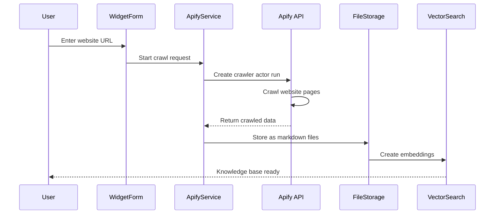

# Website Crawler Documentation

## Overview

The website crawler feature allows users to automatically crawl entire websites and import their content into widget knowledge bases. This feature is powered by Apify's Website Content Crawler and provides an efficient way to build comprehensive knowledge bases from existing web content.

## Architecture

### Core Components

1. **Apify Service** (`workers/services/apify-crawler.ts`) - Integration with Apify API
2. **Widget Form** (`app/components/widgets/WidgetForm.tsx`) - UI for initiating crawls
3. **File Storage** (`workers/services/file-storage.ts`) - Stores crawled content
4. **Vector Search** (`workers/services/vector-search.ts`) - Creates embeddings for crawled content

### How It Works



## Implementation Details

### Apify Crawler Service

```typescript
class ApifyCrawlerService {
  async crawlWebsite(url: string, widgetId: string, maxPages = 25): Promise<CrawlResult> {
    // 1. Start Apify actor run
    const run = await this.client.actor('apify/website-content-crawler').call({
      startUrls: [{ url }],
      maxCrawlPages: maxPages,
      crawlerType: 'playwright:chrome',
      includeUrlGlobs: [`${new URL(url).origin}/**`],
      proxyConfiguration: { useApifyProxy: true }
    });
    
    // 2. Wait for completion
    await this.client.run(run.id).waitForFinish();
    
    // 3. Process results
    const { items } = await this.client.dataset(run.defaultDatasetId).listItems();
    
    // 4. Store content as files
    for (const page of items) {
      await this.fileStorage.storeFile({
        widgetId,
        fileName: this.generateFileName(page.url),
        content: page.markdown || page.text,
        metadata: { sourceUrl: page.url, title: page.title }
      });
    }
  }
}
```

### Crawler Configuration

```javascript
{
  // Crawler settings
  crawlerType: 'playwright:chrome',    // Use headless Chrome for JS rendering
  maxCrawlPages: 25,                    // Limit to prevent excessive crawling
  maxCrawlDepth: 3,                     // Maximum link depth from start URL
  
  // Content settings
  includeUrlGlobs: [`${origin}/**`],    // Stay within same domain
  excludeUrlGlobs: ['**/login', '**/admin'], // Skip auth pages
  
  // Performance settings
  maxRequestRetries: 2,                 // Retry failed requests
  requestTimeoutSecs: 30,               // Page load timeout
  
  // Resource blocking
  blockRequests: [
    { resourceType: 'image' },
    { resourceType: 'media' },
    { resourceType: 'font' },
    { resourceType: 'stylesheet' }
  ],
  
  // Proxy configuration
  proxyConfiguration: {
    useApifyProxy: true,
    apifyProxyGroups: ['RESIDENTIAL']
  }
}
```

## User Interface

### Widget Form Integration

The crawler is integrated into the widget creation/edit form:

```tsx
<Card>
  <CardHeader>
    <CardTitle>Website Crawler</CardTitle>
    <CardDescription>
      Automatically import content from a website
    </CardDescription>
  </CardHeader>
  <CardContent>
    <Input
      placeholder="https://example.com"
      value={crawlUrl}
      onChange={(e) => setCrawlUrl(e.target.value)}
    />
    <Button onClick={handleCrawl} disabled={isCrawling}>
      {isCrawling ? (
        <>
          <Loader2 className="animate-spin" />
          Crawling... {crawlProgress}%
        </>
      ) : (
        'Start Crawl'
      )}
    </Button>
  </CardContent>
</Card>
```

### Progress Tracking

```typescript
// Real-time progress updates
const checkProgress = async (runId: string) => {
  const run = await apifyClient.run(runId).get();
  
  setCrawlProgress(Math.round(
    (run.stats.requestsFinished / run.stats.requestsTotal) * 100
  ));
  
  if (run.status === 'SUCCEEDED') {
    toast.success(`Crawled ${run.stats.pagesScraped} pages successfully`);
  }
};
```

## Features

### Content Extraction
- **Markdown Conversion**: HTML is converted to clean markdown
- **Metadata Preservation**: Page titles, URLs, and timestamps are stored
- **Text Extraction**: Fallback to plain text if markdown fails
- **Structured Data**: Extracts JSON-LD and other structured data

### Crawling Rules
- **Domain Boundaries**: Stays within the same hostname
- **Depth Limits**: Maximum 3 levels deep from start URL
- **Page Limits**: Maximum 25 pages per crawl
- **Resource Blocking**: Skips images, videos, and stylesheets
- **Sitemap Support**: Uses sitemap.xml when available

### Content Processing
- **Duplicate Detection**: Avoids storing duplicate content
- **URL Normalization**: Consistent file naming from URLs
- **Content Chunking**: Large pages are split for embeddings
- **Metadata Enrichment**: Adds crawl timestamp and source info

## Environment Configuration

```bash
# Required
APIFY_API_TOKEN=apify_api_xxx

# Optional
MAX_CRAWL_PAGES=25              # Maximum pages per crawl
CRAWL_TIMEOUT_MINS=10           # Maximum crawl duration
CRAWLER_CONCURRENCY=3           # Concurrent page loads
```

## Error Handling

### Common Errors

1. **Rate Limiting**
   ```typescript
   if (error.statusCode === 429) {
     throw new Error('Apify rate limit reached. Please try again later.');
   }
   ```

2. **Invalid URLs**
   ```typescript
   if (!isValidUrl(url)) {
     throw new Error('Please enter a valid website URL');
   }
   ```

3. **Timeout Handling**
   ```typescript
   const timeout = setTimeout(() => {
     controller.abort();
     throw new Error('Crawl timeout exceeded');
   }, CRAWL_TIMEOUT_MS);
   ```

### Retry Logic
```typescript
async function crawlWithRetry(url: string, attempts = 3): Promise<CrawlResult> {
  for (let i = 0; i < attempts; i++) {
    try {
      return await crawlWebsite(url);
    } catch (error) {
      if (i === attempts - 1) throw error;
      await sleep(Math.pow(2, i) * 1000); // Exponential backoff
    }
  }
}
```

## Usage Examples

### Basic Website Crawl
```typescript
// Crawl a documentation site
await crawlWebsite('https://docs.example.com', widgetId);
```

### Custom Configuration
```typescript
// Crawl with custom settings
await crawlWebsite('https://blog.example.com', widgetId, {
  maxPages: 50,
  includeUrlGlobs: ['**/posts/**', '**/articles/**'],
  excludeUrlGlobs: ['**/tag/**', '**/category/**']
});
```

### Progress Monitoring
```typescript
// Monitor crawl progress
const runId = await startCrawl(url);
const interval = setInterval(async () => {
  const status = await checkCrawlStatus(runId);
  updateProgress(status.progress);
  
  if (status.finished) {
    clearInterval(interval);
    processCrawlResults(status.results);
  }
}, 2000);
```

## Best Practices

1. **URL Selection**: Start with the most relevant section of a website
2. **Page Limits**: Use appropriate limits to avoid excessive crawling
3. **Content Review**: Review crawled content before finalizing the widget
4. **Regular Updates**: Re-crawl periodically to keep content fresh
5. **Respect robots.txt**: The crawler respects website crawling rules

## Limitations

- Maximum 25 pages per crawl (configurable)
- JavaScript-heavy sites may require longer crawl times
- Some dynamic content may not be captured
- Rate limits apply based on Apify plan
- No support for authenticated content

## Future Enhancements

- Scheduled re-crawling for content updates
- Incremental crawling (only new/changed pages)
- Custom content selectors
- Authentication support for private content
- Crawl templates for common site types