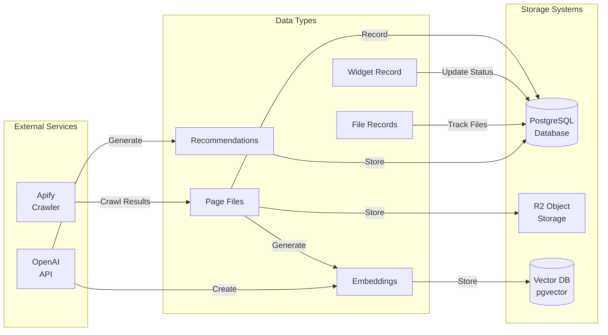
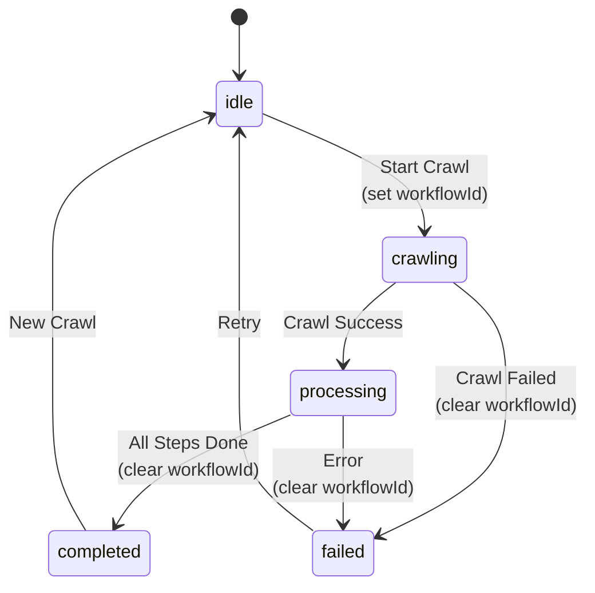

# Widget Content Pipeline Workflow Visualization

## Overview
The Widget Content Pipeline is a Cloudflare Workflow that handles the complete process of crawling websites, storing content, and generating embeddings for AI-powered chat widgets.

## Workflow Architecture

```mermaid
graph TB
    subgraph "API Endpoints"
        A1["/api/widgets/:id/crawl<br/>(User API)"]
        A2["/api/automation/widgets/:id/crawl<br/>(Automation API)"]
    end
    
    subgraph "Workflow Trigger"
        B[Create Workflow Instance<br/>WIDGET_CONTENT_WORKFLOW]
        B1[Set workflowId in DB]
    end
    
    subgraph "Widget Content Pipeline Workflow"
        C[Step 1: Update Status to 'crawling']
        D[Step 2: Start Apify Crawl]
        E[Step 3: Poll Crawl Status<br/>(max 120 attempts × 5s)]
        F{Crawl<br/>Succeeded?}
        G[Process Crawl Results]
        H[Step 4: Get Crawled Files]
        I[Step 5: Process Embeddings]
        J[Step 6: Update Status to 'completed']
        K[Step 7: Generate Recommendations]
        L[Update Status to 'failed']
    end
    
    A1 --> B
    A2 --> B
    B --> B1
    B1 --> C
    C --> D
    D --> E
    E --> F
    F -->|Yes| G
    F -->|No| L
    G --> H
    H --> I
    I --> J
    J --> K
    L --> |Clear workflowId| End1[End]
    K --> |Clear workflowId| End2[End]
```

## Detailed Step Breakdown

### 1. **Workflow Initiation**
Two endpoints can trigger the workflow:
- **User API**: `/api/widgets/:id/crawl` - Requires authentication
- **Automation API**: `/api/automation/widgets/:id/crawl` - Uses bearer token

Both endpoints:
1. Check if widget exists
2. Verify not already crawling
3. Create workflow instance
4. **Save `workflowId` to database**
5. Return workflow ID to caller

### 2. **Step 1: Update Widget Status**
```typescript
await step.do('update-widget-status-crawling', async () => {
  // Update widget:
  // - crawlStatus: 'crawling'
  // - lastCrawlAt: new Date()
});
```

### 3. **Step 2: Start Apify Crawl**
```typescript
const crawlRunId = await step.do<string>('start-crawl', async () => {
  // 1. Clean URL
  // 2. Delete existing crawl files if recrawling
  // 3. Start Apify crawler
  // 4. Update widget with crawlRunId
  return runId;
});
```

### 4. **Step 3: Poll for Completion**
```typescript
for (let attempt = 0; attempt < 120; attempt++) {
  const result = await step.do(`check-crawl-status-${attempt}`, async () => {
    // Check Apify crawl status
    if (status === 'SUCCEEDED') {
      // Process results
      return { status: 'success', pageCount };
    } else if (status === 'FAILED') {
      return { status: 'failed', error };
    }
    return null; // Continue polling
  });
  
  if (!result) {
    await step.sleep(`wait-crawl-${attempt}`, '5 seconds');
  }
}
```

### 5. **Process Crawl Results**
When crawl succeeds:
1. **Create placeholder file** (`hostname.crawl.md`)
2. **Process pages in batches** (5 pages at a time)
3. **For each page**:
   - Create markdown with metadata header
   - Store as page file in R2
   - **Create database record** for page file
   - Filename: `page-{number}.md`

### 6. **Step 5: Generate Embeddings**
```typescript
await step.do<number>('process-all-embeddings', async () => {
  // For each page file:
  // 1. Get content from R2
  // 2. Delete old embeddings if recrawling
  // 3. Create new embeddings via OpenAI
  // 4. Store in vector database
  return totalEmbeddings;
});
```

### 7. **Step 6 & 7: Finalize**
- Update widget status to 'completed'
- Store crawl metrics (runId, pageCount)
- **Clear `workflowId`** from database
- Generate AI recommendations (optional)

## Data Flow



## File Storage Structure

### R2 Object Keys
```
widgets/{widgetId}/{fileId}/{filename}           # Main files
widgets/{widgetId}/{fileId}/page_{number}.md     # Page files
```

### Database Records
- **Main crawl file**: `{hostname}.crawl.md`
- **Page files**: `page-{number}.md` (filtered from UI by default)

## Status Flow



## Key Features

1. **Workflow ID Tracking**: `workflowId` is set when workflow starts, cleared when it ends
2. **Page File Management**: Each crawled page stored as separate file with DB record
3. **Batch Processing**: Pages processed in batches of 5 to avoid memory issues
4. **Recrawl Support**: Deletes existing files before new crawl
5. **Error Recovery**: Updates status to 'failed' and clears workflowId on any error
6. **UI Filtering**: Page files hidden from UI by default (getWidgetFiles filters them)

## Error Handling

- **Timeout**: After 10 minutes (120 attempts × 5 seconds)
- **Failed Crawl**: Updates status and clears workflowId
- **Workflow Crash**: Catch block ensures status update
- **Partial Failures**: Embeddings/recommendations failures don't fail entire workflow

## Recent Updates

1. **Fixed workflowId tracking**: Both API endpoints now properly set workflowId
2. **Page files in database**: Each page file gets a database record for accurate counting
3. **UI filtering**: Page files filtered out by default to keep UI clean
4. **Proper cleanup**: Delete operations remove both R2 objects and database records