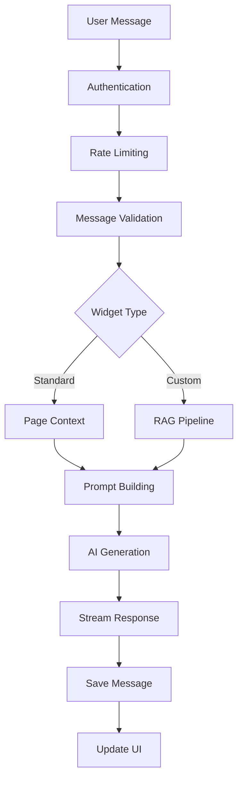

# Chat Message Processing Flow

This document describes the chat message processing logic, including real-time streaming, conversation management, and AI response generation.

## 💬 Overview

The chat flow handles user messages, generates AI responses, manages conversation state, and provides real-time streaming capabilities.

## 📊 Chat Architecture



## 🚀 Implementation

### Chat Message Handler

```typescript
// workers/routes/chat.routes.ts
import { Hono } from 'hono';
import { streamSSE } from 'hono/streaming';
import { ChatService } from '../services/chat.service';
import { RagAgentService } from '../services/rag-agent.service';

export function registerChatRoutes(app: Hono) {
  const chatService = new ChatService();
  const ragService = new RagAgentService();
  
  // Send chat message
  app.post('/api/chat', authMiddleware, async (c) => {
    const { message, widgetId, sessionId } = await c.req.json();
    
    // Validate input
    if (!message?.trim()) {
      return c.json({ error: 'Message is required' }, 400);
    }
    
    // Get widget configuration
    const widget = await widgetService.findById(widgetId);
    if (!widget) {
      return c.json({ error: 'Widget not found' }, 404);
    }
    
    // Check rate limits
    const rateLimitKey = `chat:${widgetId}:${sessionId}`;
    const limited = await checkRateLimit(rateLimitKey, {
      max: 50,
      window: '1h'
    });
    
    if (limited) {
      return c.json({ error: 'Rate limit exceeded' }, 429);
    }
    
    // Process message based on widget type
    if (widget.widgetType === 'standard') {
      return handleStandardChat(c, widget, message, sessionId);
    } else {
      return handleCustomChat(c, widget, message, sessionId);
    }
  });
  
  // Get chat history
  app.get('/api/chat/history/:widgetId', authMiddleware, async (c) => {
    const { widgetId } = c.req.param();
    const { sessionId, limit = 50 } = c.req.query();
    
    const messages = await chatService.getHistory(widgetId, sessionId, {
      limit: parseInt(limit),
      includeSystem: false
    });
    
    return c.json({ messages });
  });
}

async function handleStandardChat(
  c: Context,
  widget: Widget,
  message: string,
  sessionId: string
) {
  // Extract page context
  const pageContext = c.req.header('X-Page-Context');
  const pageUrl = c.req.header('X-Page-URL');
  
  // Build system prompt with context
  const systemPrompt = buildStandardPrompt(widget, pageContext, pageUrl);
  
  // Stream response
  return streamSSE(c, async (stream) => {
    try {
      // Save user message
      const userMessage = await chatService.saveMessage({
        widgetId: widget.id,
        sessionId,
        role: 'user',
        content: message,
        metadata: { pageUrl }
      });
      
      // Stream AI response
      const aiResponse = await streamAIResponse(
        stream,
        systemPrompt,
        message,
        sessionId
      );
      
      // Save AI message
      await chatService.saveMessage({
        widgetId: widget.id,
        sessionId,
        role: 'assistant',
        content: aiResponse,
        metadata: { 
          model: 'gpt-4o-mini',
          tokensUsed: estimateTokens(aiResponse)
        }
      });
      
    } catch (error) {
      await stream.writeSSE({
        event: 'error',
        data: JSON.stringify({ 
          error: 'Failed to generate response' 
        })
      });
    } finally {
      await stream.close();
    }
  });
}

async function handleCustomChat(
  c: Context,
  widget: Widget,
  message: string,
  sessionId: string
) {
  const ragService = new RagAgentService(c.env);
  
  return streamSSE(c, async (stream) => {
    try {
      // Get conversation history
      const history = await chatService.getHistory(
        widget.id,
        sessionId,
        { limit: 10 }
      );
      
      // Stream status updates
      await stream.writeSSE({
        event: 'status',
        data: JSON.stringify({ 
          message: 'Searching knowledge base...' 
        })
      });
      
      // Use RAG pipeline
      const ragStream = ragService.streamResponse({
        query: message,
        widgetId: widget.id,
        conversationHistory: history,
        config: widget.ragConfig
      });
      
      let fullResponse = '';
      let sources: SourceReference[] = [];
      
      for await (const chunk of ragStream) {
        switch (chunk.type) {
          case 'status':
            await stream.writeSSE({
              event: 'status',
              data: JSON.stringify(chunk.data)
            });
            break;
            
          case 'sources':
            sources = chunk.data;
            await stream.writeSSE({
              event: 'sources',
              data: JSON.stringify(chunk.data)
            });
            break;
            
          case 'content':
            fullResponse += chunk.data;
            await stream.writeSSE({
              event: 'message',
              data: chunk.data
            });
            break;
            
          case 'citations':
            await stream.writeSSE({
              event: 'citations',
              data: JSON.stringify(chunk.data)
            });
            break;
        }
      }
      
      // Save messages
      await chatService.saveMessage({
        widgetId: widget.id,
        sessionId,
        role: 'user',
        content: message
      });
      
      await chatService.saveMessage({
        widgetId: widget.id,
        sessionId,
        role: 'assistant',
        content: fullResponse,
        metadata: {
          sources: sources.map(s => ({
            fileName: s.fileName,
            similarity: s.similarity
          }))
        }
      });
      
    } catch (error) {
      console.error('Chat error:', error);
      await stream.writeSSE({
        event: 'error',
        data: JSON.stringify({ 
          error: 'Failed to process message' 
        })
      });
    } finally {
      await stream.close();
    }
  });
}
```

## 💾 Message Persistence

### Chat Service

```typescript
// workers/services/chat.service.ts
import { db } from '../db';
import { chatMessage } from '../db/schema';
import { desc, and, eq } from 'drizzle-orm';

export interface SaveMessageData {
  widgetId: string;
  sessionId: string;
  role: 'user' | 'assistant' | 'system';
  content: string;
  metadata?: Record<string, any>;
}

export class ChatService {
  async saveMessage(data: SaveMessageData): Promise<ChatMessage> {
    const [message] = await db
      .insert(chatMessage)
      .values({
        widgetId: data.widgetId,
        sessionId: data.sessionId,
        role: data.role,
        content: data.content,
        metadata: data.metadata,
        createdAt: new Date()
      })
      .returning();
      
    return message;
  }
  
  async getHistory(
    widgetId: string,
    sessionId: string,
    options: {
      limit?: number;
      includeSystem?: boolean;
      beforeId?: string;
    } = {}
  ): Promise<ChatMessage[]> {
    const conditions = [
      eq(chatMessage.widgetId, widgetId),
      eq(chatMessage.sessionId, sessionId)
    ];
    
    if (!options.includeSystem) {
      conditions.push(ne(chatMessage.role, 'system'));
    }
    
    if (options.beforeId) {
      conditions.push(lt(chatMessage.id, options.beforeId));
    }
    
    return await db
      .select()
      .from(chatMessage)
      .where(and(...conditions))
      .orderBy(desc(chatMessage.createdAt))
      .limit(options.limit || 50);
  }
  
  async deleteSession(widgetId: string, sessionId: string): Promise<void> {
    await db
      .delete(chatMessage)
      .where(and(
        eq(chatMessage.widgetId, widgetId),
        eq(chatMessage.sessionId, sessionId)
      ));
  }
  
  async getSessionStats(
    widgetId: string,
    sessionId: string
  ): Promise<SessionStats> {
    const messages = await this.getHistory(widgetId, sessionId);
    
    return {
      messageCount: messages.length,
      firstMessage: messages[messages.length - 1]?.createdAt,
      lastMessage: messages[0]?.createdAt,
      userMessages: messages.filter(m => m.role === 'user').length,
      assistantMessages: messages.filter(m => m.role === 'assistant').length,
      totalTokens: messages.reduce((sum, m) => 
        sum + (m.metadata?.tokensUsed || 0), 0
      )
    };
  }
}
```

## 🎯 Prompt Engineering

### Dynamic Prompt Building

```typescript
export function buildStandardPrompt(
  widget: Widget,
  pageContext?: string,
  pageUrl?: string
): string {
  let prompt = widget.systemPrompt || DEFAULT_SYSTEM_PROMPT;
  
  // Add widget context
  if (widget.name) {
    prompt = prompt.replace('{{WIDGET_NAME}}', widget.name);
  }
  
  // Add page context
  if (pageContext) {
    prompt += `\n\nCurrent page context:\n${pageContext}`;
  }
  
  if (pageUrl) {
    prompt += `\nUser is currently on: ${pageUrl}`;
  }
  
  // Add behavioral instructions
  prompt += `\n\nImportant instructions:
- Be helpful and conversational
- Keep responses concise unless asked for details
- If you don't know something, say so honestly
- Suggest relevant pages or resources when appropriate`;
  
  return prompt;
}

export function buildRAGPrompt(
  widget: Widget,
  searchResults: SearchResult[]
): string {
  let prompt = `You are ${widget.name || 'an AI assistant'} with access to the following knowledge base:\n\n`;
  
  // Add search results as context
  searchResults.forEach((result, index) => {
    prompt += `[${index + 1}] ${result.fileName}\n`;
    prompt += `${result.content}\n\n`;
  });
  
  // Add custom instructions
  if (widget.customPrompt) {
    prompt += `\nAdditional instructions:\n${widget.customPrompt}\n`;
  }
  
  // Add citation instructions
  prompt += `\nAlways cite your sources using [1], [2], etc. when using information from the knowledge base.`;
  
  return prompt;
}
```

## 🔄 Real-time Streaming

### SSE Stream Handler

```typescript
export async function streamAIResponse(
  stream: SSEStreamingApi,
  systemPrompt: string,
  userMessage: string,
  sessionId: string
): Promise<string> {
  const openai = new OpenAI({
    apiKey: process.env.OPENAI_API_KEY
  });
  
  // Get recent conversation history
  const history = await chatService.getHistory(
    widgetId,
    sessionId,
    { limit: 10 }
  );
  
  // Build messages array
  const messages: ChatCompletionMessageParam[] = [
    { role: 'system', content: systemPrompt }
  ];
  
  // Add history (reversed to chronological order)
  history.reverse().forEach(msg => {
    messages.push({
      role: msg.role as 'user' | 'assistant',
      content: msg.content
    });
  });
  
  // Add current message
  messages.push({ role: 'user', content: userMessage });
  
  // Create streaming completion
  const completion = await openai.chat.completions.create({
    model: 'gpt-4o-mini',
    messages,
    temperature: 0.7,
    max_tokens: 1000,
    stream: true
  });
  
  let fullResponse = '';
  
  // Stream chunks to client
  for await (const chunk of completion) {
    const content = chunk.choices[0]?.delta?.content || '';
    if (content) {
      fullResponse += content;
      await stream.writeSSE({
        event: 'message',
        data: content
      });
    }
  }
  
  // Send completion event
  await stream.writeSSE({
    event: 'done',
    data: JSON.stringify({ 
      message: 'Response complete',
      tokensUsed: estimateTokens(fullResponse)
    })
  });
  
  return fullResponse;
}
```

## 🛡️ Rate Limiting

### Token Bucket Implementation

```typescript
export class RateLimiter {
  private buckets: Map<string, TokenBucket> = new Map();
  
  async checkLimit(
    key: string,
    config: RateLimitConfig
  ): Promise<boolean> {
    const bucket = this.getBucket(key, config);
    return bucket.consume(1);
  }
  
  private getBucket(key: string, config: RateLimitConfig): TokenBucket {
    let bucket = this.buckets.get(key);
    
    if (!bucket) {
      bucket = new TokenBucket({
        capacity: config.max,
        refillRate: config.max / (config.windowMs / 1000),
        initialTokens: config.max
      });
      this.buckets.set(key, bucket);
    }
    
    return bucket;
  }
}

class TokenBucket {
  private tokens: number;
  private lastRefill: number;
  
  constructor(private config: TokenBucketConfig) {
    this.tokens = config.initialTokens;
    this.lastRefill = Date.now();
  }
  
  consume(count: number): boolean {
    this.refill();
    
    if (this.tokens >= count) {
      this.tokens -= count;
      return true;
    }
    
    return false;
  }
  
  private refill(): void {
    const now = Date.now();
    const timePassed = (now - this.lastRefill) / 1000;
    const tokensToAdd = timePassed * this.config.refillRate;
    
    this.tokens = Math.min(
      this.config.capacity,
      this.tokens + tokensToAdd
    );
    this.lastRefill = now;
  }
}
```

## 🎨 Message Formatting

### Rich Message Support

```typescript
export class MessageFormatter {
  format(content: string, type: MessageType): FormattedMessage {
    switch (type) {
      case 'markdown':
        return this.formatMarkdown(content);
      case 'code':
        return this.formatCode(content);
      case 'error':
        return this.formatError(content);
      case 'suggestion':
        return this.formatSuggestion(content);
      default:
        return { type: 'text', content };
    }
  }
  
  private formatMarkdown(content: string): FormattedMessage {
    // Parse markdown elements
    const elements: MessageElement[] = [];
    
    // Code blocks
    const codeBlockRegex = /```(\w+)?\n([\s\S]*?)```/g;
    content = content.replace(codeBlockRegex, (match, lang, code) => {
      elements.push({
        type: 'code',
        language: lang || 'plaintext',
        content: code.trim()
      });
      return `{{CODE_BLOCK_${elements.length - 1}}}`;
    });
    
    // Links
    const linkRegex = /\[([^\]]+)\]\(([^)]+)\)/g;
    content = content.replace(linkRegex, (match, text, url) => {
      elements.push({
        type: 'link',
        text,
        url
      });
      return `{{LINK_${elements.length - 1}}}`;
    });
    
    return {
      type: 'markdown',
      content,
      elements
    };
  }
  
  private formatSuggestion(content: string): FormattedMessage {
    // Parse suggestion format
    const lines = content.split('\n');
    const suggestions: Suggestion[] = [];
    
    for (const line of lines) {
      if (line.startsWith('- ')) {
        suggestions.push({
          text: line.substring(2),
          action: this.extractAction(line)
        });
      }
    }
    
    return {
      type: 'suggestions',
      content: '',
      suggestions
    };
  }
}
```

## 📊 Analytics

### Chat Analytics Service

```typescript
export class ChatAnalytics {
  async trackMessage(
    message: ChatMessage,
    responseTime?: number
  ): Promise<void> {
    const analytics: ChatAnalytic = {
      widgetId: message.widgetId,
      sessionId: message.sessionId,
      messageId: message.id,
      role: message.role,
      timestamp: message.createdAt,
      
      // Performance metrics
      responseTime,
      tokenCount: estimateTokens(message.content),
      
      // Content metrics
      messageLength: message.content.length,
      hasCode: message.content.includes('```'),
      hasLinks: /https?:\/\//.test(message.content),
      
      // Engagement metrics
      isFirstMessage: await this.isFirstMessage(message),
      sessionMessageCount: await this.getSessionMessageCount(message.sessionId)
    };
    
    await this.store(analytics);
  }
  
  async getInsights(widgetId: string): Promise<ChatInsights> {
    const data = await this.getAnalytics(widgetId, 30); // Last 30 days
    
    return {
      totalSessions: new Set(data.map(d => d.sessionId)).size,
      totalMessages: data.length,
      avgMessagesPerSession: this.calculateAvgMessagesPerSession(data),
      avgResponseTime: this.average(data.map(d => d.responseTime || 0)),
      
      // Engagement metrics
      bounceRate: this.calculateBounceRate(data),
      avgSessionDuration: this.calculateAvgSessionDuration(data),
      
      // Content insights
      topQueries: this.extractTopQueries(data),
      commonTopics: this.extractCommonTopics(data),
      
      // Performance
      responseTimeByHour: this.groupByHour(data, 'responseTime'),
      messagesPerDay: this.groupByDay(data)
    };
  }
}
```

## 🔒 Security

### Message Validation

```typescript
export class MessageValidator {
  validate(message: string): ValidationResult {
    const errors: string[] = [];
    
    // Length check
    if (message.length > MAX_MESSAGE_LENGTH) {
      errors.push(`Message exceeds maximum length of ${MAX_MESSAGE_LENGTH}`);
    }
    
    // Content moderation
    if (this.containsProfanity(message)) {
      errors.push('Message contains inappropriate content');
    }
    
    // PII detection
    const pii = this.detectPII(message);
    if (pii.length > 0) {
      errors.push(`Message contains sensitive information: ${pii.join(', ')}`);
    }
    
    // Injection attempts
    if (this.detectInjection(message)) {
      errors.push('Message contains potentially malicious content');
    }
    
    return {
      valid: errors.length === 0,
      errors,
      sanitized: this.sanitize(message)
    };
  }
  
  private detectPII(message: string): string[] {
    const patterns = {
      ssn: /\b\d{3}-\d{2}-\d{4}\b/,
      creditCard: /\b\d{4}[\s-]?\d{4}[\s-]?\d{4}[\s-]?\d{4}\b/,
      email: /\b[A-Za-z0-9._%+-]+@[A-Za-z0-9.-]+\.[A-Z|a-z]{2,}\b/,
      phone: /\b\d{3}[-.]?\d{3}[-.]?\d{4}\b/
    };
    
    const found: string[] = [];
    for (const [type, pattern] of Object.entries(patterns)) {
      if (pattern.test(message)) {
        found.push(type);
      }
    }
    
    return found;
  }
  
  private sanitize(message: string): string {
    // Remove any HTML/script tags
    message = message.replace(/<[^>]*>/g, '');
    
    // Escape special characters
    message = message
      .replace(/&/g, '&amp;')
      .replace(/</g, '&lt;')
      .replace(/>/g, '&gt;')
      .replace(/"/g, '&quot;')
      .replace(/'/g, '&#x27;');
    
    return message.trim();
  }
}
```

## 🎯 Best Practices

### Error Handling

```typescript
export class ChatErrorHandler {
  async handle(error: Error, context: ChatContext): Promise<ErrorResponse> {
    console.error('Chat error:', error, context);
    
    // Categorize error
    if (error instanceof RateLimitError) {
      return {
        code: 'RATE_LIMIT',
        message: 'Too many messages. Please wait a moment.',
        retryAfter: error.retryAfter
      };
    }
    
    if (error instanceof OpenAIError) {
      return {
        code: 'AI_SERVICE_ERROR',
        message: 'Our AI service is temporarily unavailable.',
        fallback: this.getFallbackResponse(context)
      };
    }
    
    if (error instanceof ValidationError) {
      return {
        code: 'INVALID_MESSAGE',
        message: error.message,
        details: error.validationErrors
      };
    }
    
    // Generic error
    return {
      code: 'UNKNOWN_ERROR',
      message: 'Something went wrong. Please try again.',
      requestId: context.requestId
    };
  }
  
  private getFallbackResponse(context: ChatContext): string {
    return `I'm having trouble connecting right now. You can try:
- Refreshing the page
- Checking your internet connection
- Contacting support at ${context.widget.supportEmail || 'support@example.com'}`;
  }
}
```

---

For more workflow documentation:
- [Content Pipeline](./CONTENT-PIPELINE.md)
- [Crawl Workflow](./CRAWL-WORKFLOW.md)
- [RAG Workflow](./RAG-WORKFLOW.md)