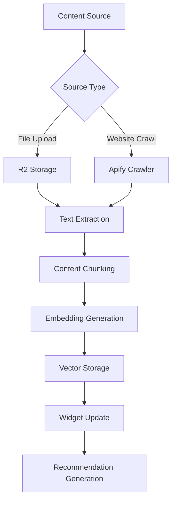

# Content Pipeline Workflow

This document describes the widget content processing workflow, which handles file uploads, website crawling, and content indexing for RAG capabilities.

## 🔄 Overview

The content pipeline is a Cloudflare Workflow that orchestrates the entire process of ingesting, processing, and indexing content for a widget.

## 📊 Workflow Architecture



## 🚀 Workflow Implementation

### Main Workflow Class

```typescript
// workers/workflows/widget-content-pipeline.ts
import { Workflow, Step, Event } from '@cloudflare/workers-types';
import { extractText } from '../services/ocr.service';
import { chunkContent } from '../services/rag-agent.service';
import { generateEmbeddings } from '../services/embedding.service';
import { generateRecommendations } from '../services/recommendation.service';

export interface ContentPipelineEvent {
  widgetId: string;
  source: 'upload' | 'crawl';
  sourceUrl?: string;
  fileKeys?: string[];
}

export class WidgetContentPipeline extends Workflow<ContentPipelineEvent> {
  async run(event: Event<ContentPipelineEvent>, step: Step) {
    const { widgetId, source, sourceUrl, fileKeys } = event.payload;

    // Step 1: Initialize widget context
    const widget = await step.do('init-widget', async () => {
      const widgetService = new WidgetService(env.DB);
      const widget = await widgetService.findById(widgetId);
      
      if (!widget) {
        throw new Error(`Widget ${widgetId} not found`);
      }
      
      // Update status to processing
      await widgetService.update(widgetId, {
        status: 'processing',
        lastProcessedAt: new Date()
      });
      
      return widget;
    });

    // Step 2: Process content based on source
    let content: ProcessedContent[];
    
    if (source === 'crawl' && sourceUrl) {
      content = await step.do('crawl-website', async () => {
        return await this.crawlWebsite(sourceUrl, widgetId);
      });
    } else if (source === 'upload' && fileKeys) {
      content = await step.do('process-files', async () => {
        return await this.processFiles(fileKeys, widgetId);
      });
    } else {
      throw new Error('Invalid source configuration');
    }

    // Step 3: Generate embeddings for all content
    const embeddings = await step.do('generate-embeddings', async () => {
      const results = [];
      
      // Process in batches to avoid timeout
      const BATCH_SIZE = 10;
      for (let i = 0; i < content.length; i += BATCH_SIZE) {
        const batch = content.slice(i, i + BATCH_SIZE);
        const batchEmbeddings = await Promise.all(
          batch.map(item => this.generateContentEmbedding(item))
        );
        results.push(...batchEmbeddings);
      }
      
      return results;
    });

    // Step 4: Store in vector database
    await step.do('store-embeddings', async () => {
      const fileService = new WidgetFileService(env.DB);
      
      // Clear existing content for full refresh
      if (widget.crawlUrl) {
        await fileService.deleteByWidgetId(widgetId);
      }
      
      // Insert new embeddings
      await fileService.createBatch(embeddings);
      
      return embeddings.length;
    });

    // Step 5: Generate AI recommendations
    const recommendations = await step.do('generate-recommendations', async () => {
      return await generateRecommendations(widgetId, env);
    });

    // Step 6: Update widget status
    await step.do('finalize-widget', async () => {
      const widgetService = new WidgetService(env.DB);
      
      await widgetService.update(widgetId, {
        status: 'active',
        lastProcessedAt: new Date(),
        contentCount: embeddings.length,
        recommendationsCount: recommendations.length
      });
    });

    return {
      success: true,
      widgetId,
      contentProcessed: embeddings.length,
      recommendationsGenerated: recommendations.length
    };
  }

  private async crawlWebsite(url: string, widgetId: string): Promise<ProcessedContent[]> {
    const crawler = new ApifyCrawlerService(env.APIFY_API_KEY);
    
    // Start crawl job
    const crawlId = await crawler.startCrawl({
      startUrl: url,
      maxPages: 100,
      maxDepth: 3,
      includeHtml: true
    });
    
    // Poll for completion (workflow handles timeout)
    let result;
    while (!result || result.status !== 'SUCCEEDED') {
      await new Promise(resolve => setTimeout(resolve, 5000));
      result = await crawler.getCrawlStatus(crawlId);
      
      if (result.status === 'FAILED') {
        throw new Error(`Crawl failed: ${result.error}`);
      }
    }
    
    // Download and process results
    const pages = await crawler.getCrawlResults(crawlId);
    
    return pages.map(page => ({
      widgetId,
      url: page.url,
      title: page.title,
      content: page.text,
      metadata: {
        crawledAt: new Date().toISOString(),
        depth: page.depth,
        links: page.links
      }
    }));
  }

  private async processFiles(fileKeys: string[], widgetId: string): Promise<ProcessedContent[]> {
    const r2Service = new R2Service(env.R2);
    const ocrService = new OCRService(env);
    
    const results = [];
    
    for (const fileKey of fileKeys) {
      // Get file from R2
      const file = await r2Service.get(fileKey);
      if (!file) continue;
      
      // Extract text based on file type
      let text: string;
      const mimeType = file.httpMetadata?.contentType || '';
      
      if (mimeType.includes('pdf') || mimeType.includes('image')) {
        // Use OCR for PDFs and images
        text = await ocrService.extractText(file);
      } else if (mimeType.includes('text')) {
        // Direct text extraction
        text = await file.text();
      } else {
        // Skip unsupported file types
        continue;
      }
      
      results.push({
        widgetId,
        fileName: fileKey.split('/').pop() || fileKey,
        content: text,
        metadata: {
          uploadedAt: new Date().toISOString(),
          mimeType,
          size: file.size
        }
      });
    }
    
    return results;
  }

  private async generateContentEmbedding(content: ProcessedContent): Promise<WidgetFileEmbedding> {
    const ragService = new RagAgentService(env);
    
    // Chunk content if too large
    const chunks = await ragService.chunkContent(content.content, {
      maxChunkSize: 1000,
      overlap: 100
    });
    
    // Generate embeddings for each chunk
    const embeddings = await Promise.all(
      chunks.map(async (chunk, index) => {
        const embedding = await ragService.generateEmbedding(chunk.text);
        
        return {
          widgetId: content.widgetId,
          fileName: content.fileName || content.url || 'content',
          content: chunk.text,
          embedding: embedding.vector,
          metadata: {
            ...content.metadata,
            chunkIndex: index,
            chunkTotal: chunks.length,
            startChar: chunk.start,
            endChar: chunk.end
          }
        };
      })
    );
    
    return embeddings;
  }
}
```

## 📁 File Upload Processing

### Upload Handler

```typescript
// workers/routes/widget-upload.routes.ts
export async function handleFileUpload(c: Context) {
  const { widgetId } = c.req.param();
  const formData = await c.req.formData();
  
  // Validate widget access
  const widget = await validateWidgetAccess(widgetId, c.get('user'));
  
  // Process uploaded files
  const fileKeys: string[] = [];
  const files = formData.getAll('files') as File[];
  
  for (const file of files) {
    // Validate file
    if (file.size > MAX_FILE_SIZE) {
      throw new Error(`File ${file.name} exceeds size limit`);
    }
    
    // Upload to R2
    const key = `widgets/${widgetId}/files/${Date.now()}-${file.name}`;
    await env.R2.put(key, file.stream(), {
      httpMetadata: {
        contentType: file.type
      }
    });
    
    fileKeys.push(key);
  }
  
  // Trigger workflow
  const workflowId = await env.WORKFLOWS.create({
    id: crypto.randomUUID(),
    workflow: 'widget-content-pipeline',
    params: {
      widgetId,
      source: 'upload',
      fileKeys
    }
  });
  
  return c.json({
    success: true,
    workflowId,
    filesUploaded: fileKeys.length
  });
}
```

## 🕷️ Website Crawling

### Crawl Configuration

```typescript
interface CrawlConfig {
  startUrl: string;
  maxPages?: number;
  maxDepth?: number;
  includePaths?: string[];
  excludePaths?: string[];
  respectRobotsTxt?: boolean;
}

export async function startWebsiteCrawl(
  widgetId: string,
  config: CrawlConfig,
  env: Env
): Promise<string> {
  // Validate URL
  const url = new URL(config.startUrl);
  if (!['http:', 'https:'].includes(url.protocol)) {
    throw new Error('Invalid URL protocol');
  }
  
  // Start workflow
  const workflowId = await env.WORKFLOWS.create({
    id: crypto.randomUUID(),
    workflow: 'widget-content-pipeline',
    params: {
      widgetId,
      source: 'crawl',
      sourceUrl: config.startUrl,
      crawlConfig: config
    }
  });
  
  return workflowId;
}
```

## 📄 Text Extraction

### OCR Service Integration

```typescript
// workers/services/ocr.service.ts
export class OCRService {
  constructor(private env: Env) {}
  
  async extractText(file: R2ObjectBody): Promise<string> {
    const arrayBuffer = await file.arrayBuffer();
    const base64 = btoa(String.fromCharCode(...new Uint8Array(arrayBuffer)));
    
    // Use Mistral AI for OCR
    const response = await fetch('https://api.mistral.ai/v1/chat/completions', {
      method: 'POST',
      headers: {
        'Authorization': `Bearer ${this.env.MISTRAL_API_KEY}`,
        'Content-Type': 'application/json'
      },
      body: JSON.stringify({
        model: 'pixtral-12b-2409',
        messages: [{
          role: 'user',
          content: [
            {
              type: 'text',
              text: 'Extract all text from this image/document. Return only the extracted text.'
            },
            {
              type: 'image_url',
              image_url: {
                url: `data:${file.httpMetadata?.contentType || 'application/octet-stream'};base64,${base64}`
              }
            }
          ]
        }],
        max_tokens: 4096
      })
    });
    
    const data = await response.json();
    return data.choices[0].message.content;
  }
}
```

## 🔪 Content Chunking

### Smart Chunking Strategy

```typescript
export async function chunkContent(
  text: string,
  options: ChunkOptions = {}
): Promise<ContentChunk[]> {
  const {
    maxChunkSize = 1000,
    overlap = 100,
    splitBy = 'sentence'
  } = options;
  
  const chunks: ContentChunk[] = [];
  
  // Split into sentences for better context preservation
  const sentences = text.match(/[^.!?]+[.!?]+/g) || [text];
  
  let currentChunk = '';
  let currentStart = 0;
  
  for (let i = 0; i < sentences.length; i++) {
    const sentence = sentences[i].trim();
    
    if (currentChunk.length + sentence.length > maxChunkSize) {
      // Save current chunk
      chunks.push({
        text: currentChunk.trim(),
        start: currentStart,
        end: currentStart + currentChunk.length
      });
      
      // Start new chunk with overlap
      const overlapText = sentences
        .slice(Math.max(0, i - 2), i)
        .join(' ');
      currentChunk = overlapText + ' ' + sentence;
      currentStart += currentChunk.length - overlapText.length - sentence.length;
    } else {
      currentChunk += ' ' + sentence;
    }
  }
  
  // Add final chunk
  if (currentChunk.trim()) {
    chunks.push({
      text: currentChunk.trim(),
      start: currentStart,
      end: text.length
    });
  }
  
  return chunks;
}
```

## 🔢 Embedding Generation

### Batch Embedding Processing

```typescript
export async function generateBatchEmbeddings(
  texts: string[],
  env: Env
): Promise<number[][]> {
  const BATCH_SIZE = 100; // OpenAI limit
  const embeddings: number[][] = [];
  
  for (let i = 0; i < texts.length; i += BATCH_SIZE) {
    const batch = texts.slice(i, i + BATCH_SIZE);
    
    const response = await fetch('https://api.openai.com/v1/embeddings', {
      method: 'POST',
      headers: {
        'Authorization': `Bearer ${env.OPENAI_API_KEY}`,
        'Content-Type': 'application/json'
      },
      body: JSON.stringify({
        input: batch,
        model: 'text-embedding-3-small',
        dimensions: 1536
      })
    });
    
    const data = await response.json();
    embeddings.push(...data.data.map(d => d.embedding));
  }
  
  return embeddings;
}
```

## 🔍 Vector Storage

### Storing Embeddings with pgvector

```typescript
export async function storeEmbeddings(
  embeddings: WidgetFileEmbedding[],
  db: Database
): Promise<void> {
  // Batch insert for performance
  const BATCH_SIZE = 50;
  
  for (let i = 0; i < embeddings.length; i += BATCH_SIZE) {
    const batch = embeddings.slice(i, i + BATCH_SIZE);
    
    await db.insert(widgetFile).values(
      batch.map(item => ({
        widgetId: item.widgetId,
        fileName: item.fileName,
        content: item.content,
        embedding: sql`${JSON.stringify(item.embedding)}::vector`,
        metadata: item.metadata,
        fileKey: item.fileKey || null
      }))
    );
  }
  
  // Create HNSW index if not exists
  await db.execute(sql`
    CREATE INDEX IF NOT EXISTS widget_file_embedding_idx 
    ON widget_file 
    USING hnsw (embedding vector_cosine_ops)
    WITH (m = 16, ef_construction = 64)
  `);
}
```

## 🎯 Recommendation Generation

### AI-Powered Recommendations

```typescript
export async function generateRecommendations(
  widgetId: string,
  env: Env
): Promise<string[]> {
  // Get widget content summary
  const widgetService = new WidgetService(env.DB);
  const widget = await widgetService.findById(widgetId);
  
  const fileService = new WidgetFileService(env.DB);
  const topContent = await fileService.getTopContent(widgetId, 10);
  
  // Generate recommendations using AI
  const prompt = `Based on the following content from a website/knowledge base, generate 5-7 relevant questions that users might ask. The questions should be specific and actionable.

Content Summary:
${topContent.map(c => c.content).join('\n\n')}

Generate questions in JSON format: ["question1", "question2", ...]`;

  const response = await fetch('https://api.openai.com/v1/chat/completions', {
    method: 'POST',
    headers: {
      'Authorization': `Bearer ${env.OPENAI_API_KEY}`,
      'Content-Type': 'application/json'
    },
    body: JSON.stringify({
      model: 'gpt-4o-mini',
      messages: [{
        role: 'system',
        content: 'You are a helpful assistant that generates relevant questions based on content.'
      }, {
        role: 'user',
        content: prompt
      }],
      response_format: { type: 'json_object' }
    })
  });
  
  const data = await response.json();
  const recommendations = JSON.parse(data.choices[0].message.content);
  
  // Store recommendations
  await widgetService.update(widgetId, {
    recommendations: recommendations.questions || recommendations
  });
  
  return recommendations.questions || recommendations;
}
```

## 📊 Monitoring & Status

### Workflow Status Tracking

```typescript
export async function getContentPipelineStatus(
  workflowId: string,
  env: Env
): Promise<PipelineStatus> {
  const instance = await env.WORKFLOWS.get(workflowId);
  
  if (!instance) {
    throw new Error('Workflow not found');
  }
  
  // Parse workflow output
  const output = instance.output as ContentPipelineOutput;
  
  return {
    id: workflowId,
    status: instance.status,
    progress: calculateProgress(instance),
    contentProcessed: output?.contentProcessed || 0,
    recommendationsGenerated: output?.recommendationsGenerated || 0,
    error: instance.error,
    startedAt: instance.createdAt,
    completedAt: instance.completedAt
  };
}

function calculateProgress(instance: WorkflowInstance): number {
  const steps = ['init-widget', 'process-content', 'generate-embeddings', 
                 'store-embeddings', 'generate-recommendations', 'finalize-widget'];
  
  const completedSteps = instance.completedSteps || [];
  return (completedSteps.length / steps.length) * 100;
}
```

## 🔧 Error Handling

### Retry Logic

```typescript
export class ContentPipelineError extends Error {
  constructor(
    message: string,
    public readonly step: string,
    public readonly retryable: boolean = true
  ) {
    super(message);
    this.name = 'ContentPipelineError';
  }
}

// In workflow step
await step.do('process-content', async () => {
  try {
    return await processContent();
  } catch (error) {
    if (error instanceof RateLimitError) {
      // Retryable error
      throw new ContentPipelineError(
        'Rate limit exceeded',
        'process-content',
        true
      );
    } else if (error instanceof InvalidContentError) {
      // Non-retryable error
      throw new ContentPipelineError(
        error.message,
        'process-content',
        false
      );
    }
    throw error;
  }
});
```

## 🚀 Performance Optimization

### Parallel Processing

```typescript
// Process multiple files in parallel
const processedContent = await Promise.all(
  fileKeys.map(async (key) => {
    return await step.do(`process-file-${key}`, async () => {
      return await processFile(key);
    });
  })
);

// Batch embedding generation
const embeddings = await step.do('generate-embeddings-batch', async () => {
  const texts = processedContent.map(c => c.content);
  return await generateBatchEmbeddings(texts, env);
});
```

---

For more workflow documentation:
- [Crawl Workflow](./CRAWL-WORKFLOW.md)
- [RAG Workflow](./RAG-WORKFLOW.md)
- [Chat Flow](./CHAT-FLOW.md)