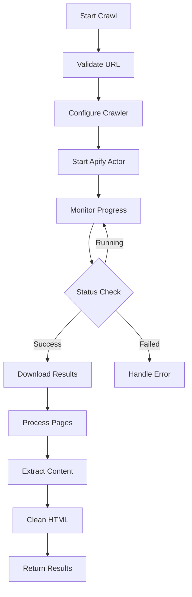

# Website Crawling Workflow

This document describes the website crawling workflow that automatically extracts and indexes content from websites for RAG capabilities.

## 🕷️ Overview

The crawl workflow integrates with Apify's web scraping platform to crawl websites, extract content, and prepare it for vector search.

## 📊 Crawl Architecture



## 🚀 Implementation

### Crawl Service

```typescript
// workers/services/apify-crawler.service.ts
import { ApifyClient } from 'apify-client';

export interface CrawlConfig {
  startUrl: string;
  maxPages?: number;
  maxDepth?: number;
  includePaths?: string[];
  excludePaths?: string[];
  respectRobotsTxt?: boolean;
  waitForSelector?: string;
  pageFunction?: string;
}

export interface CrawlResult {
  url: string;
  title: string;
  text: string;
  html?: string;
  links: string[];
  depth: number;
  error?: string;
}

export class ApifyCrawlerService {
  private client: ApifyClient;
  
  constructor(apiKey: string) {
    this.client = new ApifyClient({
      token: apiKey
    });
  }
  
  async startCrawl(config: CrawlConfig): Promise<string> {
    // Use Website Content Crawler actor
    const actor = await this.client.actor('apify/website-content-crawler');
    
    const run = await actor.call({
      startUrls: [{ url: config.startUrl }],
      maxCrawlPages: config.maxPages || 100,
      maxCrawlDepth: config.maxDepth || 3,
      includeUrlGlobs: config.includePaths?.map(p => `${config.startUrl}${p}*`),
      excludeUrlGlobs: config.excludePaths?.map(p => `${config.startUrl}${p}*`),
      respectRobotsTxt: config.respectRobotsTxt ?? true,
      crawlerType: 'playwright', // For JS-heavy sites
      waitUntil: 'networkidle',
      pageFunction: config.pageFunction || this.getDefaultPageFunction(),
      proxyConfiguration: {
        useApifyProxy: true
      }
    });
    
    return run.id;
  }
  
  async getCrawlStatus(runId: string): Promise<{
    status: string;
    error?: string;
    itemCount?: number;
  }> {
    const run = await this.client.run(runId).get();
    
    return {
      status: run.status,
      error: run.exitCode > 0 ? run.statusMessage : undefined,
      itemCount: run.stats?.itemCount
    };
  }
  
  async getCrawlResults(runId: string): Promise<CrawlResult[]> {
    const dataset = await this.client.run(runId).dataset().listItems();
    
    return dataset.items.map(item => ({
      url: item.url,
      title: item.title || this.extractTitle(item.text),
      text: this.cleanText(item.text),
      html: item.html,
      links: item.links || [],
      depth: item.depth || 0,
      error: item.error
    }));
  }
  
  private getDefaultPageFunction(): string {
    return `
      async function pageFunction(context) {
        const { page, request, log } = context;
        
        // Wait for content to load
        await page.waitForSelector('body', { timeout: 30000 });
        
        // Extract data
        const data = await page.evaluate(() => {
          // Remove script and style elements
          const scripts = document.querySelectorAll('script, style, noscript');
          scripts.forEach(el => el.remove());
          
          // Get text content
          const text = document.body.innerText || document.body.textContent || '';
          
          // Get all links
          const links = Array.from(document.querySelectorAll('a[href]'))
            .map(a => a.href)
            .filter(href => href.startsWith('http'));
          
          // Get meta description
          const metaDesc = document.querySelector('meta[name="description"]')?.content;
          
          return {
            title: document.title,
            text: text.trim(),
            html: document.documentElement.outerHTML,
            links: [...new Set(links)],
            metaDescription: metaDesc
          };
        });
        
        return {
          url: request.url,
          ...data,
          depth: request.userData.depth || 0
        };
      }
    `;
  }
  
  private cleanText(text: string): string {
    return text
      .replace(/\s+/g, ' ')
      .replace(/\n{3,}/g, '\n\n')
      .trim();
  }
  
  private extractTitle(text: string): string {
    // Extract first heading or first line as title
    const lines = text.split('\n');
    return lines[0]?.substring(0, 100) || 'Untitled';
  }
}
```

## 🎯 Crawl Configuration

### URL Validation

```typescript
export function validateCrawlUrl(url: string): void {
  try {
    const parsed = new URL(url);
    
    // Check protocol
    if (!['http:', 'https:'].includes(parsed.protocol)) {
      throw new Error('URL must use HTTP or HTTPS protocol');
    }
    
    // Check for localhost/private IPs
    const hostname = parsed.hostname;
    if (
      hostname === 'localhost' ||
      hostname === '127.0.0.1' ||
      hostname.startsWith('192.168.') ||
      hostname.startsWith('10.') ||
      hostname.startsWith('172.')
    ) {
      throw new Error('Cannot crawl local or private network URLs');
    }
    
    // Check for common non-crawlable domains
    const blockedDomains = [
      'facebook.com',
      'twitter.com',
      'instagram.com',
      'linkedin.com'
    ];
    
    if (blockedDomains.some(domain => hostname.includes(domain))) {
      throw new Error('Cannot crawl social media platforms');
    }
  } catch (error) {
    if (error instanceof TypeError) {
      throw new Error('Invalid URL format');
    }
    throw error;
  }
}
```

### Smart Crawl Defaults

```typescript
export function getCrawlDefaults(url: string): Partial<CrawlConfig> {
  const parsed = new URL(url);
  const domain = parsed.hostname;
  
  // Documentation sites
  if (domain.includes('docs.') || domain.includes('documentation.')) {
    return {
      maxPages: 200,
      maxDepth: 5,
      includePaths: ['/docs/', '/api/', '/guide/'],
      excludePaths: ['/blog/', '/changelog/']
    };
  }
  
  // Blog sites
  if (domain.includes('blog.') || parsed.pathname.includes('/blog')) {
    return {
      maxPages: 50,
      maxDepth: 2,
      includePaths: ['/blog/', '/posts/', '/articles/'],
      excludePaths: ['/tag/', '/category/', '/author/']
    };
  }
  
  // E-commerce sites
  if (domain.includes('shop.') || domain.includes('store.')) {
    return {
      maxPages: 100,
      maxDepth: 3,
      includePaths: ['/products/', '/collections/'],
      excludePaths: ['/cart/', '/checkout/', '/account/']
    };
  }
  
  // Default configuration
  return {
    maxPages: 100,
    maxDepth: 3,
    excludePaths: [
      '/login',
      '/signin',
      '/signup',
      '/register',
      '/cart',
      '/checkout',
      '/account',
      '/admin',
      '/wp-admin'
    ]
  };
}
```

## 📄 Content Processing

### HTML Cleaning

```typescript
// workers/services/html-cleaner.service.ts
import { JSDOM } from 'jsdom';
import DOMPurify from 'isomorphic-dompurify';

export class HTMLCleanerService {
  clean(html: string): string {
    // Parse HTML
    const dom = new JSDOM(html);
    const document = dom.window.document;
    
    // Remove unwanted elements
    const unwantedSelectors = [
      'script',
      'style',
      'noscript',
      'iframe',
      'object',
      'embed',
      'nav',
      'header',
      'footer',
      '.sidebar',
      '.advertisement',
      '#comments',
      '.social-share'
    ];
    
    unwantedSelectors.forEach(selector => {
      document.querySelectorAll(selector).forEach(el => el.remove());
    });
    
    // Clean with DOMPurify
    const clean = DOMPurify.sanitize(document.body.innerHTML, {
      ALLOWED_TAGS: ['p', 'h1', 'h2', 'h3', 'h4', 'h5', 'h6', 
                     'ul', 'ol', 'li', 'blockquote', 'pre', 'code',
                     'table', 'thead', 'tbody', 'tr', 'th', 'td'],
      ALLOWED_ATTR: []
    });
    
    // Convert to text
    const textDom = new JSDOM(clean);
    return textDom.window.document.body.textContent || '';
  }
  
  extractStructuredData(html: string): {
    title?: string;
    description?: string;
    keywords?: string[];
    author?: string;
    publishedDate?: string;
  } {
    const dom = new JSDOM(html);
    const document = dom.window.document;
    
    return {
      title: document.querySelector('title')?.textContent || 
             document.querySelector('h1')?.textContent,
      description: document.querySelector('meta[name="description"]')?.content ||
                   document.querySelector('meta[property="og:description"]')?.content,
      keywords: document.querySelector('meta[name="keywords"]')?.content?.split(',').map(k => k.trim()),
      author: document.querySelector('meta[name="author"]')?.content,
      publishedDate: document.querySelector('meta[property="article:published_time"]')?.content ||
                     document.querySelector('time')?.getAttribute('datetime')
    };
  }
}
```

### Content Deduplication

```typescript
export class ContentDeduplicator {
  private seenHashes = new Set<string>();
  
  async isDuplicate(content: string): Promise<boolean> {
    // Generate content hash
    const hash = await this.generateHash(content);
    
    if (this.seenHashes.has(hash)) {
      return true;
    }
    
    this.seenHashes.add(hash);
    return false;
  }
  
  async deduplicatePages(pages: CrawlResult[]): Promise<CrawlResult[]> {
    const unique: CrawlResult[] = [];
    
    for (const page of pages) {
      // Check URL patterns
      if (this.isRedundantUrl(page.url)) {
        continue;
      }
      
      // Check content similarity
      const isDupe = await this.isDuplicate(page.text);
      if (!isDupe) {
        unique.push(page);
      }
    }
    
    return unique;
  }
  
  private isRedundantUrl(url: string): boolean {
    const parsed = new URL(url);
    
    // Skip print versions
    if (parsed.pathname.includes('/print/') || 
        parsed.searchParams.has('print')) {
      return true;
    }
    
    // Skip mobile versions if we have desktop
    if (parsed.hostname.startsWith('m.') || 
        parsed.hostname.startsWith('mobile.')) {
      return true;
    }
    
    // Skip pagination beyond first page
    const page = parsed.searchParams.get('page') || 
                 parsed.searchParams.get('p');
    if (page && parseInt(page) > 1) {
      return true;
    }
    
    return false;
  }
  
  private async generateHash(content: string): Promise<string> {
    // Use Web Crypto API
    const encoder = new TextEncoder();
    const data = encoder.encode(content);
    const hashBuffer = await crypto.subtle.digest('SHA-256', data);
    const hashArray = Array.from(new Uint8Array(hashBuffer));
    return hashArray.map(b => b.toString(16).padStart(2, '0')).join('');
  }
}
```

## 🔄 Incremental Crawling

### Change Detection

```typescript
export interface CrawlState {
  widgetId: string;
  lastCrawledAt: Date;
  urlHashes: Map<string, string>;
  sitemapUrl?: string;
}

export class IncrementalCrawler {
  async shouldRecrawl(
    url: string,
    lastCrawled: Date,
    currentHash: string,
    previousHash?: string
  ): Promise<boolean> {
    // Check if content changed
    if (previousHash && currentHash !== previousHash) {
      return true;
    }
    
    // Check age
    const age = Date.now() - lastCrawled.getTime();
    const maxAge = this.getMaxAge(url);
    
    return age > maxAge;
  }
  
  private getMaxAge(url: string): number {
    // Different max ages for different content types
    if (url.includes('/blog/') || url.includes('/news/')) {
      return 24 * 60 * 60 * 1000; // 1 day
    }
    
    if (url.includes('/docs/') || url.includes('/api/')) {
      return 7 * 24 * 60 * 60 * 1000; // 1 week
    }
    
    // Default: 1 month
    return 30 * 24 * 60 * 60 * 1000;
  }
  
  async getModifiedPages(
    sitemapUrl: string,
    since: Date
  ): Promise<string[]> {
    // Fetch and parse sitemap
    const response = await fetch(sitemapUrl);
    const xml = await response.text();
    
    // Parse sitemap (simplified)
    const urls: string[] = [];
    const urlMatches = xml.matchAll(/<loc>(.*?)<\/loc>/g);
    const modMatches = xml.matchAll(/<lastmod>(.*?)<\/lastmod>/g);
    
    for (const [urlMatch, modMatch] of zip(urlMatches, modMatches)) {
      const url = urlMatch[1];
      const lastMod = new Date(modMatch[1]);
      
      if (lastMod > since) {
        urls.push(url);
      }
    }
    
    return urls;
  }
}
```

## 📊 Progress Tracking

### Real-time Updates

```typescript
export class CrawlProgressTracker {
  private progress: Map<string, CrawlProgress> = new Map();
  
  async updateProgress(
    crawlId: string,
    update: Partial<CrawlProgress>
  ): Promise<void> {
    const current = this.progress.get(crawlId) || {
      totalPages: 0,
      crawledPages: 0,
      failedPages: 0,
      status: 'starting'
    };
    
    const updated = { ...current, ...update };
    this.progress.set(crawlId, updated);
    
    // Emit websocket update
    await this.emitUpdate(crawlId, updated);
  }
  
  async emitUpdate(
    crawlId: string,
    progress: CrawlProgress
  ): Promise<void> {
    // Send to connected clients
    const message = {
      type: 'crawl-progress',
      crawlId,
      progress: {
        ...progress,
        percentage: (progress.crawledPages / progress.totalPages) * 100
      }
    };
    
    // Emit via Durable Object or WebSocket
    await this.broadcast(message);
  }
}
```

## 🚨 Error Handling

### Retry Strategy

```typescript
export class CrawlRetryStrategy {
  async crawlWithRetry(
    url: string,
    config: CrawlConfig,
    maxRetries: number = 3
  ): Promise<CrawlResult> {
    let lastError: Error | undefined;
    
    for (let attempt = 1; attempt <= maxRetries; attempt++) {
      try {
        // Add exponential backoff
        if (attempt > 1) {
          await this.delay(Math.pow(2, attempt - 1) * 1000);
        }
        
        // Attempt crawl
        const result = await this.crawlPage(url, config);
        return result;
        
      } catch (error) {
        lastError = error as Error;
        
        // Don't retry on permanent errors
        if (this.isPermanentError(error)) {
          throw error;
        }
        
        console.warn(`Crawl attempt ${attempt} failed:`, error);
      }
    }
    
    throw new Error(`Failed to crawl after ${maxRetries} attempts: ${lastError?.message}`);
  }
  
  private isPermanentError(error: any): boolean {
    // 4xx errors are permanent
    if (error.statusCode >= 400 && error.statusCode < 500) {
      return true;
    }
    
    // Robot.txt blocks are permanent
    if (error.message?.includes('robots.txt')) {
      return true;
    }
    
    return false;
  }
  
  private delay(ms: number): Promise<void> {
    return new Promise(resolve => setTimeout(resolve, ms));
  }
}
```

## 🔒 Security & Compliance

### Robots.txt Compliance

```typescript
export class RobotsChecker {
  private cache = new Map<string, RobotsRules>();
  
  async canCrawl(url: string): Promise<boolean> {
    const parsed = new URL(url);
    const robotsUrl = `${parsed.protocol}//${parsed.host}/robots.txt`;
    
    // Check cache
    let rules = this.cache.get(parsed.host);
    
    if (!rules) {
      rules = await this.fetchRobotsTxt(robotsUrl);
      this.cache.set(parsed.host, rules);
    }
    
    return this.checkRules(rules, parsed.pathname);
  }
  
  private async fetchRobotsTxt(url: string): Promise<RobotsRules> {
    try {
      const response = await fetch(url);
      if (!response.ok) {
        // No robots.txt means allow all
        return { disallow: [] };
      }
      
      const text = await response.text();
      return this.parseRobotsTxt(text);
    } catch (error) {
      // Error fetching means allow all
      return { disallow: [] };
    }
  }
  
  private parseRobotsTxt(text: string): RobotsRules {
    const lines = text.split('\n');
    const disallow: string[] = [];
    let isOurAgent = false;
    
    for (const line of lines) {
      const trimmed = line.trim();
      
      if (trimmed.startsWith('User-agent:')) {
        const agent = trimmed.substring(11).trim();
        isOurAgent = agent === '*' || agent === 'WebsyteBot';
      }
      
      if (isOurAgent && trimmed.startsWith('Disallow:')) {
        const path = trimmed.substring(9).trim();
        if (path) {
          disallow.push(path);
        }
      }
    }
    
    return { disallow };
  }
}
```

## 🎯 Best Practices

### Crawl Optimization

```typescript
// 1. Use appropriate crawl depth
const config: CrawlConfig = {
  maxDepth: 3, // Deeper isn't always better
  maxPages: 100 // Limit to relevant content
};

// 2. Filter URLs during crawl
const config: CrawlConfig = {
  includePaths: ['/docs/', '/guides/'],
  excludePaths: ['/search/', '/tag/']
};

// 3. Respect rate limits
const config: CrawlConfig = {
  requestsPerMinute: 60,
  concurrent: 5
};

// 4. Handle JavaScript sites
const config: CrawlConfig = {
  crawlerType: 'playwright',
  waitForSelector: '#content'
};
```

---

For more workflow documentation:
- [Content Pipeline](./CONTENT-PIPELINE.md)
- [RAG Workflow](./RAG-WORKFLOW.md)
- [Chat Flow](./CHAT-FLOW.md)