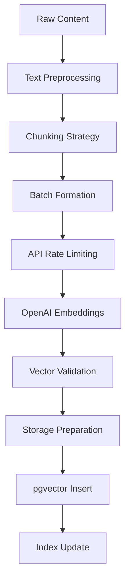

# Document Embedding Generation Process

This document describes the embedding generation process that converts text content into vector representations for semantic search.

## 🎯 Overview

The embedding process transforms textual content into high-dimensional vectors that capture semantic meaning, enabling similarity-based search and retrieval.

## 📊 Embedding Architecture



## 🚀 Implementation

### Embedding Service

```typescript
// workers/services/embedding.service.ts
import { OpenAI } from 'openai';
import { RateLimiter } from '../lib/rate-limiter';

export interface EmbeddingConfig {
  model?: string;
  dimensions?: number;
  batchSize?: number;
  maxRetries?: number;
  rateLimit?: number;
}

export interface TextChunk {
  id: string;
  text: string;
  metadata?: Record<string, any>;
  start: number;
  end: number;
}

export interface EmbeddingResult {
  id: string;
  vector: number[];
  model: string;
  usage: {
    promptTokens: number;
    totalTokens: number;
  };
}

export class EmbeddingService {
  private openai: OpenAI;
  private rateLimiter: RateLimiter;
  private config: Required<EmbeddingConfig>;
  
  constructor(apiKey: string, config?: EmbeddingConfig) {
    this.openai = new OpenAI({ apiKey });
    this.config = {
      model: 'text-embedding-3-small',
      dimensions: 1536,
      batchSize: 100,
      maxRetries: 3,
      rateLimit: 3000, // per minute
      ...config
    };
    
    this.rateLimiter = new RateLimiter({
      tokensPerInterval: this.config.rateLimit,
      interval: 'minute'
    });
  }
  
  async generateEmbeddings(
    chunks: TextChunk[]
  ): Promise<EmbeddingResult[]> {
    const results: EmbeddingResult[] = [];
    
    // Process in batches
    for (let i = 0; i < chunks.length; i += this.config.batchSize) {
      const batch = chunks.slice(i, i + this.config.batchSize);
      
      // Wait for rate limit
      await this.rateLimiter.removeTokens(batch.length);
      
      try {
        const batchResults = await this.generateBatch(batch);
        results.push(...batchResults);
      } catch (error) {
        console.error(`Batch ${i / this.config.batchSize} failed:`, error);
        
        // Retry individual items on batch failure
        for (const chunk of batch) {
          try {
            const result = await this.generateSingle(chunk);
            results.push(result);
          } catch (err) {
            console.error(`Failed to embed chunk ${chunk.id}:`, err);
            // Continue with other chunks
          }
        }
      }
    }
    
    return results;
  }
  
  private async generateBatch(
    chunks: TextChunk[]
  ): Promise<EmbeddingResult[]> {
    const response = await this.openai.embeddings.create({
      input: chunks.map(c => c.text),
      model: this.config.model,
      dimensions: this.config.dimensions
    });
    
    return response.data.map((embedding, index) => ({
      id: chunks[index].id,
      vector: embedding.embedding,
      model: this.config.model,
      usage: {
        promptTokens: response.usage.prompt_tokens,
        totalTokens: response.usage.total_tokens
      }
    }));
  }
  
  private async generateSingle(
    chunk: TextChunk
  ): Promise<EmbeddingResult> {
    let lastError: Error | null = null;
    
    for (let attempt = 0; attempt < this.config.maxRetries; attempt++) {
      try {
        const response = await this.openai.embeddings.create({
          input: chunk.text,
          model: this.config.model,
          dimensions: this.config.dimensions
        });
        
        return {
          id: chunk.id,
          vector: response.data[0].embedding,
          model: this.config.model,
          usage: {
            promptTokens: response.usage.prompt_tokens,
            totalTokens: response.usage.total_tokens
          }
        };
      } catch (error) {
        lastError = error as Error;
        
        // Exponential backoff
        if (attempt < this.config.maxRetries - 1) {
          await this.delay(Math.pow(2, attempt) * 1000);
        }
      }
    }
    
    throw lastError || new Error('Failed to generate embedding');
  }
  
  private delay(ms: number): Promise<void> {
    return new Promise(resolve => setTimeout(resolve, ms));
  }
}
```

## 🔪 Text Preprocessing

### Content Sanitization

```typescript
export class TextPreprocessor {
  preprocess(text: string): string {
    // Remove excessive whitespace
    text = text.replace(/\s+/g, ' ').trim();
    
    // Remove zero-width characters
    text = text.replace(/[\u200B-\u200D\uFEFF]/g, '');
    
    // Normalize quotes and apostrophes
    text = text
      .replace(/['']/g, "'")
      .replace(/[""]/g, '"');
    
    // Remove control characters
    text = text.replace(/[\x00-\x1F\x7F]/g, '');
    
    // Normalize line breaks
    text = text.replace(/\r\n/g, '\n').replace(/\r/g, '\n');
    
    // Remove multiple consecutive line breaks
    text = text.replace(/\n{3,}/g, '\n\n');
    
    return text;
  }
  
  detectLanguage(text: string): string {
    // Simple language detection based on character sets
    const scripts = {
      latin: /[a-zA-Z]/g,
      chinese: /[\u4e00-\u9fa5]/g,
      japanese: /[\u3040-\u309f\u30a0-\u30ff]/g,
      korean: /[\uac00-\ud7af]/g,
      arabic: /[\u0600-\u06ff]/g,
      cyrillic: /[\u0400-\u04ff]/g
    };
    
    const counts: Record<string, number> = {};
    for (const [script, regex] of Object.entries(scripts)) {
      const matches = text.match(regex);
      counts[script] = matches ? matches.length : 0;
    }
    
    // Return dominant script
    return Object.entries(counts)
      .sort(([, a], [, b]) => b - a)[0][0];
  }
  
  splitSentences(text: string): string[] {
    // Language-aware sentence splitting
    const language = this.detectLanguage(text);
    
    if (language === 'chinese' || language === 'japanese') {
      // Use different punctuation for CJK languages
      return text.split(/[。！？]+/).filter(s => s.trim());
    }
    
    // Default sentence splitting for Latin scripts
    const sentences = text.match(/[^.!?]+[.!?]+/g) || [text];
    return sentences.map(s => s.trim()).filter(s => s);
  }
}
```

## 📏 Chunking Strategies

### Smart Content Chunking

```typescript
export interface ChunkingOptions {
  strategy: 'fixed' | 'sentence' | 'paragraph' | 'semantic';
  maxChunkSize: number;
  minChunkSize: number;
  overlap: number;
  preserveBoundaries: boolean;
}

export class ContentChunker {
  chunk(
    text: string,
    options: ChunkingOptions
  ): TextChunk[] {
    switch (options.strategy) {
      case 'fixed':
        return this.fixedSizeChunking(text, options);
      case 'sentence':
        return this.sentenceChunking(text, options);
      case 'paragraph':
        return this.paragraphChunking(text, options);
      case 'semantic':
        return this.semanticChunking(text, options);
      default:
        return this.sentenceChunking(text, options);
    }
  }
  
  private sentenceChunking(
    text: string,
    options: ChunkingOptions
  ): TextChunk[] {
    const preprocessor = new TextPreprocessor();
    const sentences = preprocessor.splitSentences(text);
    const chunks: TextChunk[] = [];
    
    let currentChunk = '';
    let currentStart = 0;
    let sentenceStart = 0;
    
    for (let i = 0; i < sentences.length; i++) {
      const sentence = sentences[i];
      const sentenceLength = sentence.length;
      
      // Check if adding this sentence exceeds max size
      if (currentChunk.length + sentenceLength > options.maxChunkSize) {
        // Save current chunk if it meets minimum size
        if (currentChunk.length >= options.minChunkSize) {
          chunks.push({
            id: `chunk-${chunks.length}`,
            text: currentChunk.trim(),
            start: currentStart,
            end: sentenceStart - 1,
            metadata: {
              sentences: currentChunk.split(/[.!?]+/).length - 1
            }
          });
          
          // Start new chunk with overlap
          const overlapSentences = this.getOverlapSentences(
            sentences,
            i,
            options.overlap
          );
          currentChunk = overlapSentences.join(' ') + ' ' + sentence;
          currentStart = sentenceStart - overlapSentences.join(' ').length;
        } else {
          // Continue building chunk
          currentChunk += ' ' + sentence;
        }
      } else {
        currentChunk += (currentChunk ? ' ' : '') + sentence;
      }
      
      sentenceStart += sentenceLength + 1;
    }
    
    // Add final chunk
    if (currentChunk.trim()) {
      chunks.push({
        id: `chunk-${chunks.length}`,
        text: currentChunk.trim(),
        start: currentStart,
        end: text.length - 1,
        metadata: {
          sentences: currentChunk.split(/[.!?]+/).length - 1
        }
      });
    }
    
    return chunks;
  }
  
  private semanticChunking(
    text: string,
    options: ChunkingOptions
  ): TextChunk[] {
    // Use topic modeling or section detection
    const sections = this.detectSections(text);
    const chunks: TextChunk[] = [];
    
    for (const section of sections) {
      if (section.text.length <= options.maxChunkSize) {
        chunks.push({
          id: `chunk-${chunks.length}`,
          text: section.text,
          start: section.start,
          end: section.end,
          metadata: {
            title: section.title,
            level: section.level
          }
        });
      } else {
        // Recursively chunk large sections
        const subChunks = this.sentenceChunking(section.text, options);
        subChunks.forEach(chunk => {
          chunk.start += section.start;
          chunk.end += section.start;
          chunk.metadata = { ...chunk.metadata, ...section.metadata };
        });
        chunks.push(...subChunks);
      }
    }
    
    return chunks;
  }
  
  private detectSections(text: string): Section[] {
    const sections: Section[] = [];
    const lines = text.split('\n');
    
    let currentSection: Section | null = null;
    let currentText = '';
    let lineStart = 0;
    
    for (const line of lines) {
      // Detect headers (simple heuristic)
      if (this.isHeader(line)) {
        // Save previous section
        if (currentSection) {
          currentSection.text = currentText.trim();
          currentSection.end = lineStart - 1;
          sections.push(currentSection);
        }
        
        // Start new section
        currentSection = {
          title: line.trim(),
          text: '',
          start: lineStart,
          end: 0,
          level: this.getHeaderLevel(line)
        };
        currentText = '';
      } else {
        currentText += line + '\n';
      }
      
      lineStart += line.length + 1;
    }
    
    // Add final section
    if (currentSection) {
      currentSection.text = currentText.trim();
      currentSection.end = text.length - 1;
      sections.push(currentSection);
    }
    
    return sections;
  }
  
  private isHeader(line: string): boolean {
    // Check for markdown headers
    if (/^#{1,6}\s/.test(line)) return true;
    
    // Check for uppercase lines (common header pattern)
    if (line.length > 0 && line === line.toUpperCase()) return true;
    
    // Check for numbered sections
    if (/^\d+(\.\d+)*\s/.test(line)) return true;
    
    return false;
  }
}
```

## 🔢 Vector Operations

### Vector Validation and Normalization

```typescript
export class VectorProcessor {
  validateVector(vector: number[], expectedDim: number): boolean {
    // Check dimensions
    if (vector.length !== expectedDim) {
      return false;
    }
    
    // Check for valid numbers
    if (!vector.every(v => typeof v === 'number' && !isNaN(v))) {
      return false;
    }
    
    // Check magnitude
    const magnitude = this.getMagnitude(vector);
    if (magnitude === 0) {
      return false;
    }
    
    return true;
  }
  
  normalizeVector(vector: number[]): number[] {
    const magnitude = this.getMagnitude(vector);
    if (magnitude === 0) {
      throw new Error('Cannot normalize zero vector');
    }
    
    return vector.map(v => v / magnitude);
  }
  
  getMagnitude(vector: number[]): number {
    return Math.sqrt(vector.reduce((sum, v) => sum + v * v, 0));
  }
  
  cosineSimilarity(a: number[], b: number[]): number {
    if (a.length !== b.length) {
      throw new Error('Vectors must have same dimensions');
    }
    
    let dotProduct = 0;
    let magnitudeA = 0;
    let magnitudeB = 0;
    
    for (let i = 0; i < a.length; i++) {
      dotProduct += a[i] * b[i];
      magnitudeA += a[i] * a[i];
      magnitudeB += b[i] * b[i];
    }
    
    magnitudeA = Math.sqrt(magnitudeA);
    magnitudeB = Math.sqrt(magnitudeB);
    
    if (magnitudeA === 0 || magnitudeB === 0) {
      return 0;
    }
    
    return dotProduct / (magnitudeA * magnitudeB);
  }
  
  averageVectors(vectors: number[][]): number[] {
    if (vectors.length === 0) {
      throw new Error('Cannot average empty vector array');
    }
    
    const dimensions = vectors[0].length;
    const average = new Array(dimensions).fill(0);
    
    for (const vector of vectors) {
      for (let i = 0; i < dimensions; i++) {
        average[i] += vector[i];
      }
    }
    
    return average.map(v => v / vectors.length);
  }
}
```

## 💾 Storage Optimization

### Batch Storage with pgvector

```typescript
export class VectorStorage {
  constructor(private db: Database) {}
  
  async storeBatch(
    embeddings: EmbeddingResult[],
    widgetId: string
  ): Promise<void> {
    const BATCH_SIZE = 50;
    
    // Prepare data for insertion
    const records = embeddings.map(emb => ({
      widgetId,
      embedding: emb.vector,
      metadata: {
        model: emb.model,
        tokensUsed: emb.usage.totalTokens,
        createdAt: new Date().toISOString()
      }
    }));
    
    // Insert in batches
    for (let i = 0; i < records.length; i += BATCH_SIZE) {
      const batch = records.slice(i, i + BATCH_SIZE);
      
      await this.db.transaction(async (tx) => {
        // Insert embeddings
        const inserted = await tx
          .insert(widgetFile)
          .values(batch.map(record => ({
            widgetId: record.widgetId,
            embedding: sql`${JSON.stringify(record.embedding)}::vector`,
            metadata: record.metadata
          })))
          .returning();
        
        // Update widget statistics
        await tx
          .update(widget)
          .set({
            embeddingCount: sql`embedding_count + ${batch.length}`,
            lastEmbeddingUpdate: new Date()
          })
          .where(eq(widget.id, widgetId));
      });
    }
    
    // Optimize index after bulk insert
    await this.optimizeIndex(widgetId);
  }
  
  private async optimizeIndex(widgetId: string): Promise<void> {
    // Update HNSW index parameters based on data size
    const count = await this.getEmbeddingCount(widgetId);
    
    if (count > 10000) {
      // Adjust index parameters for larger datasets
      await this.db.execute(sql`
        ALTER INDEX widget_file_embedding_idx 
        SET (m = 32, ef_construction = 128)
      `);
    }
    
    // Vacuum analyze for query optimization
    await this.db.execute(sql`
      VACUUM ANALYZE widget_file
    `);
  }
}
```

## 📊 Monitoring & Metrics

### Embedding Quality Metrics

```typescript
export class EmbeddingMetrics {
  async analyzeEmbeddings(
    widgetId: string
  ): Promise<EmbeddingAnalysis> {
    const embeddings = await this.getEmbeddings(widgetId);
    
    return {
      totalEmbeddings: embeddings.length,
      
      // Diversity metrics
      averageSimilarity: this.calculateAverageSimilarity(embeddings),
      similarityDistribution: this.getSimilarityDistribution(embeddings),
      
      // Coverage metrics
      tokenCoverage: this.calculateTokenCoverage(embeddings),
      uniqueTokens: this.countUniqueTokens(embeddings),
      
      // Quality indicators
      zeroVectors: embeddings.filter(e => this.isZeroVector(e.vector)).length,
      duplicates: this.findDuplicates(embeddings).length,
      
      // Performance metrics
      averageTokensPerChunk: this.averageTokens(embeddings),
      storageSize: this.calculateStorageSize(embeddings)
    };
  }
  
  private calculateAverageSimilarity(
    embeddings: Embedding[]
  ): number {
    if (embeddings.length < 2) return 0;
    
    let totalSimilarity = 0;
    let comparisons = 0;
    
    // Sample random pairs to avoid O(n²) complexity
    const sampleSize = Math.min(100, embeddings.length);
    
    for (let i = 0; i < sampleSize; i++) {
      const idx1 = Math.floor(Math.random() * embeddings.length);
      const idx2 = Math.floor(Math.random() * embeddings.length);
      
      if (idx1 !== idx2) {
        const similarity = this.cosineSimilarity(
          embeddings[idx1].vector,
          embeddings[idx2].vector
        );
        totalSimilarity += similarity;
        comparisons++;
      }
    }
    
    return totalSimilarity / comparisons;
  }
  
  private findDuplicates(embeddings: Embedding[]): Embedding[] {
    const duplicates: Embedding[] = [];
    const seen = new Map<string, Embedding>();
    
    for (const emb of embeddings) {
      const hash = this.hashVector(emb.vector);
      
      if (seen.has(hash)) {
        duplicates.push(emb);
      } else {
        seen.set(hash, emb);
      }
    }
    
    return duplicates;
  }
  
  private hashVector(vector: number[]): string {
    // Create a hash of the vector for duplicate detection
    const rounded = vector.map(v => Math.round(v * 1000) / 1000);
    return JSON.stringify(rounded);
  }
}
```

## 🚀 Performance Optimization

### Caching and Deduplication

```typescript
export class EmbeddingCache {
  private cache: LRUCache<string, number[]>;
  
  constructor(maxSize: number = 10000) {
    this.cache = new LRUCache({ max: maxSize });
  }
  
  async getOrGenerate(
    text: string,
    generator: () => Promise<number[]>
  ): Promise<number[]> {
    const hash = await this.hashText(text);
    
    // Check cache
    const cached = this.cache.get(hash);
    if (cached) {
      return cached;
    }
    
    // Generate new embedding
    const embedding = await generator();
    this.cache.set(hash, embedding);
    
    return embedding;
  }
  
  private async hashText(text: string): Promise<string> {
    const encoder = new TextEncoder();
    const data = encoder.encode(text);
    const hashBuffer = await crypto.subtle.digest('SHA-256', data);
    const hashArray = Array.from(new Uint8Array(hashBuffer));
    return hashArray.map(b => b.toString(16).padStart(2, '0')).join('');
  }
}
```

---

For more workflow documentation:
- [Content Pipeline](./CONTENT-PIPELINE.md)
- [RAG Workflow](./RAG-WORKFLOW.md)
- [Chat Flow](./CHAT-FLOW.md)