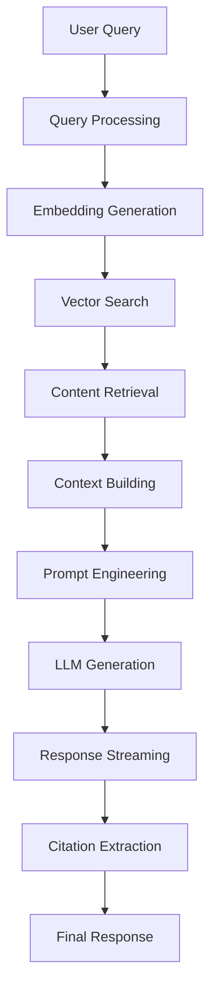

# RAG (Retrieval-Augmented Generation) Workflow

This document describes the RAG pipeline implementation that powers the intelligent chat responses using vector search and context-aware generation.

## 🎯 Overview

The RAG workflow retrieves relevant content from the vector database and uses it to generate accurate, contextual responses to user queries.

## 📊 RAG Architecture



## 🚀 Implementation

### RAG Agent Service

```typescript
// workers/services/rag-agent.service.ts
import { OpenAI } from 'openai';
import { WidgetFileService } from './widget-file.service';
import { sql } from 'drizzle-orm';

export interface RAGConfig {
  maxContextTokens?: number;
  temperature?: number;
  topK?: number;
  similarityThreshold?: number;
  includeMetadata?: boolean;
}

export interface RAGContext {
  query: string;
  widgetId: string;
  conversationHistory?: Message[];
  config?: RAGConfig;
}

export interface RAGResult {
  response: string;
  sources: SourceReference[];
  tokensUsed: number;
  searchResults: number;
}

export class RagAgentService {
  private openai: OpenAI;
  private fileService: WidgetFileService;
  
  constructor(private env: Env) {
    this.openai = new OpenAI({
      apiKey: env.OPENAI_API_KEY
    });
    this.fileService = new WidgetFileService(env.DB);
  }
  
  async generateResponse(context: RAGContext): Promise<RAGResult> {
    const config = {
      maxContextTokens: 3000,
      temperature: 0.7,
      topK: 10,
      similarityThreshold: 0.7,
      includeMetadata: true,
      ...context.config
    };
    
    // Step 1: Generate query embedding
    const queryEmbedding = await this.generateEmbedding(context.query);
    
    // Step 2: Search for relevant content
    const searchResults = await this.searchContent(
      context.widgetId,
      queryEmbedding,
      config
    );
    
    // Step 3: Build context from search results
    const { contextText, sources } = this.buildContext(
      searchResults,
      config.maxContextTokens
    );
    
    // Step 4: Generate response with context
    const response = await this.generateWithContext(
      context.query,
      contextText,
      context.conversationHistory,
      config.temperature
    );
    
    // Step 5: Extract citations from response
    const { text, citations } = this.extractCitations(response, sources);
    
    return {
      response: text,
      sources: citations,
      tokensUsed: this.estimateTokens(contextText + response),
      searchResults: searchResults.length
    };
  }
  
  async generateEmbedding(text: string): Promise<number[]> {
    const response = await this.openai.embeddings.create({
      input: text,
      model: 'text-embedding-3-small',
      dimensions: 1536
    });
    
    return response.data[0].embedding;
  }
  
  private async searchContent(
    widgetId: string,
    queryEmbedding: number[],
    config: RAGConfig
  ): Promise<SearchResult[]> {
    // Vector similarity search using pgvector
    const results = await this.env.DB.execute(sql`
      SELECT 
        id,
        file_name,
        content,
        metadata,
        1 - (embedding <=> ${JSON.stringify(queryEmbedding)}::vector) as similarity
      FROM widget_file
      WHERE widget_id = ${widgetId}
        AND 1 - (embedding <=> ${JSON.stringify(queryEmbedding)}::vector) > ${config.similarityThreshold}
      ORDER BY embedding <=> ${JSON.stringify(queryEmbedding)}::vector
      LIMIT ${config.topK}
    `);
    
    return results.rows.map(row => ({
      id: row.id,
      fileName: row.file_name,
      content: row.content,
      metadata: row.metadata,
      similarity: row.similarity
    }));
  }
  
  private buildContext(
    searchResults: SearchResult[],
    maxTokens: number
  ): { contextText: string; sources: SourceReference[] } {
    const sources: SourceReference[] = [];
    let contextText = '';
    let currentTokens = 0;
    
    // Sort by similarity and build context
    for (const result of searchResults) {
      const chunk = this.formatContextChunk(result);
      const chunkTokens = this.estimateTokens(chunk);
      
      if (currentTokens + chunkTokens > maxTokens) {
        break;
      }
      
      contextText += chunk + '\n\n';
      currentTokens += chunkTokens;
      
      sources.push({
        id: result.id,
        fileName: result.fileName,
        content: result.content.substring(0, 200),
        similarity: result.similarity,
        metadata: result.metadata
      });
    }
    
    return { contextText, sources };
  }
  
  private formatContextChunk(result: SearchResult): string {
    const metadata = result.metadata || {};
    let chunk = `[Source: ${result.fileName}`;
    
    if (metadata.url) {
      chunk += ` - ${metadata.url}`;
    }
    
    chunk += `]\n${result.content}`;
    
    return chunk;
  }
  
  private async generateWithContext(
    query: string,
    context: string,
    history?: Message[],
    temperature: number = 0.7
  ): Promise<string> {
    const messages: ChatCompletionMessageParam[] = [
      {
        role: 'system',
        content: `You are a helpful AI assistant that answers questions based on the provided context. 
Always cite your sources using [1], [2], etc. when referring to information from the context.
If the context doesn't contain relevant information, say so clearly.
Be concise but thorough in your responses.`
      }
    ];
    
    // Add conversation history
    if (history) {
      for (const msg of history.slice(-5)) { // Last 5 messages
        messages.push({
          role: msg.role as 'user' | 'assistant',
          content: msg.content
        });
      }
    }
    
    // Add current query with context
    messages.push({
      role: 'user',
      content: `Context:\n${context}\n\nQuestion: ${query}`
    });
    
    const completion = await this.openai.chat.completions.create({
      model: 'gpt-4o-mini',
      messages,
      temperature,
      max_tokens: 1000,
      stream: false
    });
    
    return completion.choices[0].message.content || '';
  }
  
  private extractCitations(
    response: string,
    sources: SourceReference[]
  ): { text: string; citations: SourceReference[] } {
    const citationRegex = /\[(\d+)\]/g;
    const citedIndices = new Set<number>();
    
    // Find all citation references
    let match;
    while ((match = citationRegex.exec(response)) !== null) {
      const index = parseInt(match[1]) - 1;
      if (index >= 0 && index < sources.length) {
        citedIndices.add(index);
      }
    }
    
    // Get only cited sources
    const citations = Array.from(citedIndices)
      .map(i => sources[i])
      .filter(Boolean);
    
    return { text: response, citations };
  }
  
  private estimateTokens(text: string): number {
    // Rough estimation: ~4 characters per token
    return Math.ceil(text.length / 4);
  }
}
```

## 🔍 Query Processing

### Query Enhancement

```typescript
export class QueryEnhancer {
  async enhance(query: string, context?: QueryContext): Promise<string> {
    // Expand abbreviations
    query = this.expandAbbreviations(query);
    
    // Add contextual hints
    if (context?.domain) {
      query = this.addDomainContext(query, context.domain);
    }
    
    // Fix common typos
    query = await this.correctSpelling(query);
    
    // Expand with synonyms for better recall
    query = this.expandSynonyms(query);
    
    return query;
  }
  
  private expandAbbreviations(query: string): string {
    const abbreviations: Record<string, string> = {
      'api': 'API application programming interface',
      'ui': 'UI user interface',
      'ux': 'UX user experience',
      'db': 'database',
      'auth': 'authentication authorization'
    };
    
    let expanded = query;
    for (const [abbr, full] of Object.entries(abbreviations)) {
      const regex = new RegExp(`\\b${abbr}\\b`, 'gi');
      expanded = expanded.replace(regex, `${abbr} ${full}`);
    }
    
    return expanded;
  }
  
  private addDomainContext(query: string, domain: string): string {
    const domainKeywords: Record<string, string[]> = {
      'documentation': ['docs', 'guide', 'tutorial', 'reference'],
      'ecommerce': ['product', 'cart', 'checkout', 'order'],
      'blog': ['article', 'post', 'author', 'category']
    };
    
    const keywords = domainKeywords[domain] || [];
    return `${query} ${keywords.join(' ')}`;
  }
  
  private expandSynonyms(query: string): string {
    const synonyms: Record<string, string[]> = {
      'create': ['make', 'build', 'generate', 'add'],
      'delete': ['remove', 'destroy', 'erase'],
      'update': ['modify', 'change', 'edit'],
      'error': ['bug', 'issue', 'problem', 'failure']
    };
    
    let expanded = query;
    for (const [word, syns] of Object.entries(synonyms)) {
      if (query.toLowerCase().includes(word)) {
        expanded += ` ${syns.join(' ')}`;
      }
    }
    
    return expanded;
  }
}
```

## 🎨 Prompt Engineering

### Dynamic Prompt Templates

```typescript
export class PromptTemplateEngine {
  private templates: Map<string, PromptTemplate> = new Map([
    ['technical', {
      system: `You are a technical documentation assistant. Provide accurate, detailed answers with code examples when relevant. Always cite sources.`,
      userPrefix: 'Technical Question: ',
      style: 'precise and detailed'
    }],
    ['conversational', {
      system: `You are a friendly AI assistant. Provide helpful, easy-to-understand answers. Use simple language and examples.`,
      userPrefix: '',
      style: 'friendly and approachable'
    }],
    ['support', {
      system: `You are a customer support assistant. Be empathetic, solution-focused, and guide users step-by-step.`,
      userPrefix: 'Support Request: ',
      style: 'helpful and patient'
    }]
  ]);
  
  getTemplate(type: string, widget: Widget): PromptTemplate {
    const base = this.templates.get(type) || this.templates.get('conversational')!;
    
    // Customize based on widget settings
    if (widget.customPrompt) {
      return {
        ...base,
        system: widget.customPrompt + '\n\n' + base.system
      };
    }
    
    return base;
  }
  
  buildPrompt(
    query: string,
    context: string,
    template: PromptTemplate,
    metadata?: Record<string, any>
  ): string {
    let prompt = template.userPrefix + query;
    
    // Add metadata context
    if (metadata?.currentPage) {
      prompt = `[User is on page: ${metadata.currentPage}]\n${prompt}`;
    }
    
    // Add search context
    prompt = `Context from knowledge base:\n${context}\n\n${prompt}`;
    
    // Add response style hints
    prompt += `\n\nPlease respond in a ${template.style} manner.`;
    
    return prompt;
  }
}
```

## 📈 Relevance Scoring

### Hybrid Scoring System

```typescript
export class RelevanceScorer {
  score(
    query: string,
    document: Document,
    vectorSimilarity: number
  ): number {
    // Combine multiple signals
    const scores = {
      vector: vectorSimilarity * 0.5,
      keyword: this.keywordScore(query, document) * 0.2,
      freshness: this.freshnessScore(document) * 0.1,
      popularity: this.popularityScore(document) * 0.1,
      length: this.lengthScore(document) * 0.1
    };
    
    // Weighted combination
    const finalScore = Object.values(scores).reduce((a, b) => a + b, 0);
    
    // Apply boost factors
    return this.applyBoosts(finalScore, document);
  }
  
  private keywordScore(query: string, doc: Document): number {
    const queryTerms = query.toLowerCase().split(/\s+/);
    const docTerms = doc.content.toLowerCase().split(/\s+/);
    
    let matches = 0;
    for (const term of queryTerms) {
      if (docTerms.includes(term)) {
        matches++;
      }
    }
    
    return matches / queryTerms.length;
  }
  
  private freshnessScore(doc: Document): number {
    if (!doc.metadata?.lastModified) return 0.5;
    
    const age = Date.now() - new Date(doc.metadata.lastModified).getTime();
    const daysSinceModified = age / (1000 * 60 * 60 * 24);
    
    // Exponential decay
    return Math.exp(-daysSinceModified / 30);
  }
  
  private popularityScore(doc: Document): number {
    const views = doc.metadata?.views || 0;
    const clicks = doc.metadata?.clicks || 0;
    
    // Logarithmic scaling
    return Math.min(1, Math.log10(views + clicks + 1) / 3);
  }
  
  private lengthScore(doc: Document): number {
    const length = doc.content.length;
    
    // Prefer medium-length documents
    if (length < 100) return 0.3;
    if (length > 5000) return 0.7;
    return 1.0;
  }
  
  private applyBoosts(score: number, doc: Document): number {
    let boosted = score;
    
    // Title match boost
    if (doc.metadata?.isTitle) {
      boosted *= 1.5;
    }
    
    // FAQ boost
    if (doc.metadata?.isFAQ) {
      boosted *= 1.3;
    }
    
    // Negative boost for archived content
    if (doc.metadata?.isArchived) {
      boosted *= 0.5;
    }
    
    return Math.min(1, boosted);
  }
}
```

## 🔄 Response Streaming

### Stream Handler

```typescript
export class RAGStreamHandler {
  async *streamResponse(
    context: RAGContext
  ): AsyncGenerator<StreamChunk, void, unknown> {
    const ragService = new RagAgentService(this.env);
    
    // Get search results first
    const queryEmbedding = await ragService.generateEmbedding(context.query);
    const searchResults = await ragService.searchContent(
      context.widgetId,
      queryEmbedding,
      context.config || {}
    );
    
    // Yield search status
    yield {
      type: 'status',
      data: {
        message: `Found ${searchResults.length} relevant results`,
        phase: 'search_complete'
      }
    };
    
    // Build context
    const { contextText, sources } = ragService.buildContext(
      searchResults,
      context.config?.maxContextTokens || 3000
    );
    
    // Yield sources
    yield {
      type: 'sources',
      data: sources
    };
    
    // Stream AI response
    const stream = await this.openai.chat.completions.create({
      model: 'gpt-4o-mini',
      messages: this.buildMessages(context, contextText),
      temperature: context.config?.temperature || 0.7,
      stream: true
    });
    
    let fullResponse = '';
    for await (const chunk of stream) {
      const content = chunk.choices[0]?.delta?.content || '';
      fullResponse += content;
      
      yield {
        type: 'content',
        data: content
      };
    }
    
    // Final citation check
    const citations = this.extractCitations(fullResponse, sources);
    yield {
      type: 'citations',
      data: citations
    };
  }
}
```

## 🧪 Quality Assurance

### Response Validation

```typescript
export class ResponseValidator {
  async validate(
    response: RAGResult,
    context: RAGContext
  ): Promise<ValidationResult> {
    const checks = await Promise.all([
      this.checkCitations(response),
      this.checkRelevance(response, context),
      this.checkCompleteness(response),
      this.checkAccuracy(response),
      this.checkTone(response)
    ]);
    
    const issues = checks.filter(c => !c.passed);
    
    return {
      passed: issues.length === 0,
      issues,
      score: (checks.length - issues.length) / checks.length
    };
  }
  
  private async checkCitations(response: RAGResult): Promise<Check> {
    // Ensure all factual claims have citations
    const factualClaims = this.extractFactualClaims(response.response);
    const citationPattern = /\[\d+\]/g;
    const citations = response.response.match(citationPattern) || [];
    
    return {
      name: 'citations',
      passed: factualClaims.length <= citations.length,
      message: `Found ${factualClaims.length} claims, ${citations.length} citations`
    };
  }
  
  private async checkRelevance(
    response: RAGResult,
    context: RAGContext
  ): Promise<Check> {
    // Use embeddings to check semantic similarity
    const queryEmb = await this.generateEmbedding(context.query);
    const responseEmb = await this.generateEmbedding(response.response);
    
    const similarity = this.cosineSimilarity(queryEmb, responseEmb);
    
    return {
      name: 'relevance',
      passed: similarity > 0.6,
      message: `Relevance score: ${(similarity * 100).toFixed(1)}%`
    };
  }
}
```

## 📊 Analytics & Feedback

### RAG Performance Metrics

```typescript
export class RAGAnalytics {
  async trackQuery(
    context: RAGContext,
    result: RAGResult,
    feedback?: UserFeedback
  ): Promise<void> {
    const metrics: RAGMetrics = {
      widgetId: context.widgetId,
      query: context.query,
      timestamp: new Date(),
      
      // Search metrics
      searchResultCount: result.searchResults,
      topSimilarity: result.sources[0]?.similarity || 0,
      avgSimilarity: this.average(result.sources.map(s => s.similarity)),
      
      // Response metrics
      responseLength: result.response.length,
      citationCount: result.sources.length,
      tokensUsed: result.tokensUsed,
      
      // Quality metrics
      userSatisfied: feedback?.satisfied,
      responseTime: feedback?.responseTime,
      
      // Context metrics
      contextSize: result.sources.reduce((sum, s) => sum + s.content.length, 0)
    };
    
    // Store in analytics database
    await this.storeMetrics(metrics);
    
    // Update model if feedback provided
    if (feedback?.satisfied === false) {
      await this.recordFailedQuery(context, result, feedback);
    }
  }
  
  async getInsights(widgetId: string): Promise<RAGInsights> {
    const metrics = await this.getMetrics(widgetId, 30); // Last 30 days
    
    return {
      totalQueries: metrics.length,
      avgResponseTime: this.average(metrics.map(m => m.responseTime || 0)),
      avgSimilarity: this.average(metrics.map(m => m.avgSimilarity)),
      satisfactionRate: this.calculateSatisfactionRate(metrics),
      
      topQueries: this.getTopQueries(metrics),
      lowPerformingQueries: this.getLowPerformingQueries(metrics),
      
      recommendations: this.generateRecommendations(metrics)
    };
  }
}
```

## 🔧 Configuration

### RAG Pipeline Settings

```typescript
export const DEFAULT_RAG_CONFIG: RAGConfig = {
  // Embedding settings
  embeddingModel: 'text-embedding-3-small',
  embeddingDimensions: 1536,
  
  // Search settings
  maxContextTokens: 3000,
  topK: 10,
  similarityThreshold: 0.7,
  
  // Generation settings
  generationModel: 'gpt-4o-mini',
  temperature: 0.7,
  maxResponseTokens: 1000,
  
  // Quality settings
  includeSources: true,
  validateResponse: true,
  
  // Performance settings
  cacheResults: true,
  cacheTTL: 3600, // 1 hour
  
  // Safety settings
  moderateContent: true,
  blockPII: true
};

// Widget-specific overrides
export function getRAGConfig(widget: Widget): RAGConfig {
  return {
    ...DEFAULT_RAG_CONFIG,
    ...widget.ragConfig,
    
    // Enforce limits based on plan
    maxContextTokens: Math.min(
      widget.ragConfig?.maxContextTokens || DEFAULT_RAG_CONFIG.maxContextTokens,
      widget.plan === 'pro' ? 5000 : 3000
    )
  };
}
```

---

For more workflow documentation:
- [Content Pipeline](./CONTENT-PIPELINE.md)
- [Crawl Workflow](./CRAWL-WORKFLOW.md)
- [Chat Flow](./CHAT-FLOW.md)