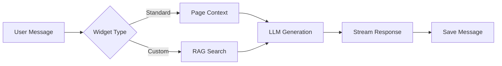
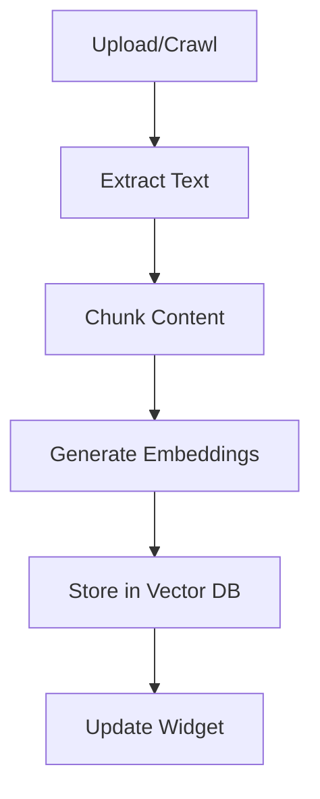
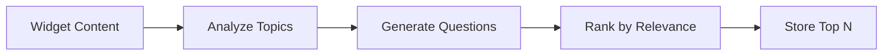

# Workflows Documentation

This directory contains documentation for Cloudflare Workflows and business logic processes in the Websyte AI Chat Widget.

## 📚 Documentation Index

### Core Workflows
- [**CONTENT-PIPELINE.md**](./CONTENT-PIPELINE.md) - Widget content processing workflow
- [**CRAWL-WORKFLOW.md**](./CRAWL-WORKFLOW.md) - Website crawling and indexing
- [**RAG-WORKFLOW.md**](./RAG-WORKFLOW.md) - RAG pipeline implementation

### Business Logic
- [**CHAT-FLOW.md**](./CHAT-FLOW.md) - Chat message processing logic
- [**EMBEDDING-PROCESS.md**](./EMBEDDING-PROCESS.md) - Document embedding generation
- [**RECOMMENDATION-ENGINE.md**](./RECOMMENDATION-ENGINE.md) - AI recommendation generation

## 🔄 What are Cloudflare Workflows?

Cloudflare Workflows enable durable, multi-step business logic that can:
- Run for up to 15 minutes
- Survive failures and retries
- Execute steps in sequence or parallel
- Handle long-running operations

## 🏗️ Workflow Architecture

### Widget Content Pipeline
The main workflow that orchestrates content processing:

```typescript
// workers/workflows/widget-content-pipeline.ts
export class WidgetContentPipeline extends Workflow {
  async run(event: Event, step: Step) {
    // Step 1: Initialize widget
    const widget = await step.do('init-widget', async () => {
      return await getWidget(event.payload.widgetId);
    });

    // Step 2: Start crawling
    const crawlResult = await step.do('start-crawl', async () => {
      return await startCrawl(widget.crawlUrl);
    });

    // Step 3: Process content
    const content = await step.do('process-content', async () => {
      return await processPages(crawlResult.pages);
    });

    // Step 4: Generate embeddings
    await step.do('generate-embeddings', async () => {
      return await createEmbeddings(content);
    });

    // Step 5: Generate recommendations
    await step.do('generate-recommendations', async () => {
      return await generateRecommendations(widget.id);
    });

    return { success: true, widgetId: widget.id };
  }
}
```

## 🔄 Business Process Flows

### 1. Chat Message Flow


### 2. Content Processing Flow


### 3. Recommendation Generation


## 💡 Key Concepts

### Step Functions
Each workflow step is atomic and can be retried:
```typescript
const result = await step.do('step-name', async () => {
  // Step logic here
  // Must be idempotent
  return stepResult;
});
```

### Error Handling
Workflows automatically retry failed steps:
```typescript
const data = await step.do('fetch-data', async () => {
  try {
    return await fetchExternalData();
  } catch (error) {
    // Log error for debugging
    console.error('Step failed:', error);
    // Re-throw to trigger retry
    throw error;
  }
});
```

### Parallel Execution
Run multiple steps concurrently:
```typescript
const [result1, result2] = await Promise.all([
  step.do('task-1', async () => processTask1()),
  step.do('task-2', async () => processTask2()),
]);
```

## 🚀 Common Workflows

### Website Crawling
1. Validate URL
2. Start Apify crawler
3. Monitor progress
4. Download results
5. Process pages
6. Generate embeddings
7. Update widget status

### Document Processing
1. Upload file to R2
2. Extract text (OCR if needed)
3. Clean and format content
4. Chunk into segments
5. Generate embeddings
6. Store in database

### Chat Enhancement
1. Receive user message
2. Search relevant context
3. Build enhanced prompt
4. Generate AI response
5. Stream to client
6. Save conversation

## 🔧 Implementation Details

### Workflow Registration
```typescript
// workers/app.ts
export default {
  async fetch(request: Request, env: Env) {
    // Regular API handling
    return app.fetch(request, env);
  },
  
  async workflow(event: Event, env: Env) {
    const workflow = new WidgetContentPipeline();
    return await workflow.run(event, env);
  }
};
```

### Triggering Workflows
```typescript
// Start a workflow from API
async function startContentProcessing(widgetId: string) {
  const workflowId = crypto.randomUUID();
  
  await env.WORKFLOWS.create({
    id: workflowId,
    workflow: 'widget-content-pipeline',
    params: { widgetId }
  });
  
  // Store workflow ID for tracking
  await updateWidget(widgetId, { workflowId });
  
  return workflowId;
}
```

### Monitoring Progress
```typescript
// Check workflow status
async function getWorkflowStatus(workflowId: string) {
  const instance = await env.WORKFLOWS.get(workflowId);
  
  return {
    id: workflowId,
    status: instance.status,
    output: instance.output,
    error: instance.error
  };
}
```

## 📊 Performance Considerations

### Timeouts
- Individual steps: 30 seconds
- Total workflow: 15 minutes
- Plan accordingly for long operations

### Resource Limits
- Memory: 128MB per step
- CPU: Standard Workers limits
- Concurrent workflows: Based on plan

### Best Practices
1. Keep steps idempotent
2. Use small, focused steps
3. Handle partial failures
4. Log progress for debugging
5. Clean up resources

## 🐛 Debugging Workflows

### Logging
```typescript
const result = await step.do('process-data', async () => {
  console.log('[Workflow] Starting data processing');
  const processed = await processData(data);
  console.log('[Workflow] Processed:', processed.length, 'items');
  return processed;
});
```

### Error Tracking
```typescript
try {
  await step.do('risky-operation', async () => {
    return await riskyOperation();
  });
} catch (error) {
  // Log to external service
  await logError('workflow-error', {
    workflowId: event.id,
    step: 'risky-operation',
    error: error.message
  });
  throw error; // Re-throw for retry
}
```

## 🔒 Security

### Input Validation
Always validate workflow inputs:
```typescript
async run(event: Event, step: Step) {
  // Validate payload
  const { widgetId, userId } = event.payload;
  if (!widgetId || !userId) {
    throw new Error('Missing required parameters');
  }
  
  // Verify permissions
  const hasAccess = await verifyAccess(widgetId, userId);
  if (!hasAccess) {
    throw new Error('Unauthorized');
  }
  
  // Continue with workflow...
}
```

### Rate Limiting
Implement workflow-level rate limiting:
```typescript
const key = `workflow:${userId}:${Date.now() / 60000 | 0}`;
const count = await env.RATE_LIMIT.get(key);

if (parseInt(count) > MAX_WORKFLOWS_PER_MINUTE) {
  throw new Error('Rate limit exceeded');
}

await env.RATE_LIMIT.put(key, (parseInt(count) + 1).toString(), {
  expirationTtl: 60
});
```

---

For detailed workflow documentation:
- [Content Pipeline](./CONTENT-PIPELINE.md)
- [Crawl Workflow](./CRAWL-WORKFLOW.md)
- [Chat Flow](./CHAT-FLOW.md)