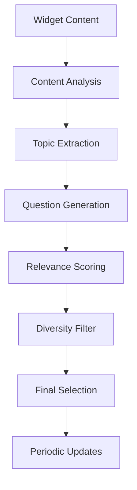

# AI Recommendation Generation Engine

This document describes the recommendation engine that generates intelligent suggestions and questions based on widget content.

## 🎯 Overview

The recommendation engine analyzes widget content to generate contextually relevant questions, suggestions, and conversation starters that help users engage with the chat widget.

## 📊 Recommendation Architecture



## 🚀 Implementation

### Recommendation Service

```typescript
// workers/services/recommendation.service.ts
import { OpenAI } from 'openai';
import { WidgetFileService } from './widget-file.service';
import { ContentAnalyzer } from '../lib/content-analyzer';

export interface RecommendationConfig {
  minQuestions?: number;
  maxQuestions?: number;
  updateFrequency?: 'daily' | 'weekly' | 'monthly';
  diversityThreshold?: number;
  relevanceThreshold?: number;
  language?: string;
  tone?: 'professional' | 'casual' | 'friendly';
}

export interface GeneratedRecommendation {
  question: string;
  category: string;
  relevanceScore: number;
  keywords: string[];
  expectedIntent: string;
}

export class RecommendationService {
  private openai: OpenAI;
  private fileService: WidgetFileService;
  private analyzer: ContentAnalyzer;
  
  constructor(private env: Env) {
    this.openai = new OpenAI({
      apiKey: env.OPENAI_API_KEY
    });
    this.fileService = new WidgetFileService(env.DB);
    this.analyzer = new ContentAnalyzer();
  }
  
  async generateRecommendations(
    widgetId: string,
    config?: RecommendationConfig
  ): Promise<string[]> {
    const settings = {
      minQuestions: 5,
      maxQuestions: 10,
      diversityThreshold: 0.7,
      relevanceThreshold: 0.6,
      language: 'en',
      tone: 'friendly' as const,
      ...config
    };
    
    // Step 1: Analyze content
    const contentAnalysis = await this.analyzeWidgetContent(widgetId);
    
    // Step 2: Extract key topics
    const topics = await this.extractTopics(contentAnalysis);
    
    // Step 3: Generate questions for each topic
    const candidates = await this.generateQuestionCandidates(
      topics,
      contentAnalysis,
      settings
    );
    
    // Step 4: Score and filter
    const scored = await this.scoreRecommendations(candidates, contentAnalysis);
    const filtered = this.filterByDiversity(scored, settings.diversityThreshold);
    
    // Step 5: Select final recommendations
    const final = this.selectFinalRecommendations(
      filtered,
      settings.minQuestions,
      settings.maxQuestions
    );
    
    return final.map(r => r.question);
  }
  
  private async analyzeWidgetContent(
    widgetId: string
  ): Promise<ContentAnalysis> {
    // Get all content
    const files = await this.fileService.getByWidgetId(widgetId);
    
    // Aggregate content
    const fullText = files.map(f => f.content).join('\n\n');
    
    // Analyze content characteristics
    return {
      totalWords: this.analyzer.countWords(fullText),
      uniqueWords: this.analyzer.getUniqueWords(fullText),
      avgSentenceLength: this.analyzer.getAvgSentenceLength(fullText),
      readabilityScore: this.analyzer.calculateReadability(fullText),
      
      // Topic modeling
      mainTopics: await this.analyzer.extractMainTopics(fullText),
      entities: await this.analyzer.extractEntities(fullText),
      
      // Content type detection
      contentType: this.detectContentType(files),
      domain: this.detectDomain(fullText),
      
      // Metadata
      fileCount: files.length,
      lastUpdated: Math.max(...files.map(f => f.createdAt.getTime()))
    };
  }
  
  private async extractTopics(
    analysis: ContentAnalysis
  ): Promise<Topic[]> {
    const topics: Topic[] = [];
    
    // Use TF-IDF for keyword extraction
    const keywords = this.analyzer.extractKeywords(analysis.fullText, {
      maxKeywords: 20,
      minFrequency: 2,
      useIDF: true
    });
    
    // Group keywords into topics
    const topicClusters = await this.clusterKeywords(keywords);
    
    // Generate topic descriptions
    for (const cluster of topicClusters) {
      const topic = await this.generateTopicDescription(cluster);
      topics.push(topic);
    }
    
    // Add entity-based topics
    for (const entity of analysis.entities) {
      if (entity.type === 'PRODUCT' || entity.type === 'FEATURE') {
        topics.push({
          name: entity.text,
          keywords: [entity.text, ...entity.related],
          type: 'entity',
          importance: entity.frequency / analysis.totalWords
        });
      }
    }
    
    return topics;
  }
  
  private async generateQuestionCandidates(
    topics: Topic[],
    analysis: ContentAnalysis,
    config: RecommendationConfig
  ): Promise<GeneratedRecommendation[]> {
    const candidates: GeneratedRecommendation[] = [];
    
    // Generate multiple questions per topic
    for (const topic of topics) {
      const topicQuestions = await this.generateTopicQuestions(
        topic,
        analysis,
        config
      );
      candidates.push(...topicQuestions);
    }
    
    // Add general questions based on content type
    const generalQuestions = await this.generateGeneralQuestions(
      analysis,
      config
    );
    candidates.push(...generalQuestions);
    
    // Add trending/popular questions
    const trendingQuestions = await this.generateTrendingQuestions(
      analysis.domain,
      config
    );
    candidates.push(...trendingQuestions);
    
    return candidates;
  }
  
  private async generateTopicQuestions(
    topic: Topic,
    analysis: ContentAnalysis,
    config: RecommendationConfig
  ): Promise<GeneratedRecommendation[]> {
    const prompt = `Generate 3-5 questions about "${topic.name}" based on the following context:
    
Keywords: ${topic.keywords.join(', ')}
Content Type: ${analysis.contentType}
Domain: ${analysis.domain}
Tone: ${config.tone}

Guidelines:
- Questions should be specific and actionable
- Use natural, conversational language
- Avoid yes/no questions
- Focus on user needs and pain points
- Questions should lead to informative answers

Format: Return as JSON array with structure:
[{
  "question": "...",
  "intent": "learn|troubleshoot|compare|implement",
  "keywords": ["keyword1", "keyword2"]
}]`;

    const response = await this.openai.chat.completions.create({
      model: 'gpt-4o-mini',
      messages: [{
        role: 'system',
        content: 'You are an expert at generating relevant questions based on content analysis.'
      }, {
        role: 'user',
        content: prompt
      }],
      response_format: { type: 'json_object' },
      temperature: 0.8
    });
    
    const generated = JSON.parse(response.choices[0].message.content || '{"questions":[]}');
    const questions = generated.questions || generated;
    
    return questions.map((q: any) => ({
      question: q.question,
      category: topic.name,
      relevanceScore: topic.importance,
      keywords: q.keywords || topic.keywords,
      expectedIntent: q.intent || 'learn'
    }));
  }
}
```

## 🎨 Question Generation Strategies

### Intent-Based Generation

```typescript
export class IntentBasedGenerator {
  private intentTemplates: Map<string, QuestionTemplate[]> = new Map([
    ['learn', [
      { template: 'What is {topic}?', complexity: 'basic' },
      { template: 'How does {topic} work?', complexity: 'intermediate' },
      { template: 'What are the benefits of {topic}?', complexity: 'basic' },
      { template: 'Can you explain {topic} in detail?', complexity: 'advanced' }
    ]],
    ['troubleshoot', [
      { template: 'Why is {topic} not working?', complexity: 'basic' },
      { template: 'How do I fix {issue} with {topic}?', complexity: 'intermediate' },
      { template: 'What causes {issue} in {topic}?', complexity: 'advanced' }
    ]],
    ['compare', [
      { template: 'What\'s the difference between {topic1} and {topic2}?', complexity: 'intermediate' },
      { template: '{topic1} vs {topic2}: which is better?', complexity: 'basic' },
      { template: 'How does {topic} compare to alternatives?', complexity: 'advanced' }
    ]],
    ['implement', [
      { template: 'How do I set up {topic}?', complexity: 'basic' },
      { template: 'What are the steps to implement {topic}?', complexity: 'intermediate' },
      { template: 'Best practices for using {topic}?', complexity: 'advanced' }
    ]]
  ]);
  
  generateByIntent(
    intent: string,
    topics: string[],
    complexity: string = 'intermediate'
  ): string[] {
    const templates = this.intentTemplates.get(intent) || [];
    const questions: string[] = [];
    
    for (const template of templates) {
      if (template.complexity === complexity) {
        for (const topic of topics) {
          const question = this.fillTemplate(template.template, { topic });
          questions.push(question);
        }
      }
    }
    
    return questions;
  }
  
  private fillTemplate(
    template: string,
    values: Record<string, string>
  ): string {
    let filled = template;
    
    for (const [key, value] of Object.entries(values)) {
      filled = filled.replace(new RegExp(`{${key}}`, 'g'), value);
    }
    
    return filled;
  }
}
```

## 📊 Relevance Scoring

### Multi-Factor Scoring System

```typescript
export class RelevanceScorer {
  score(
    recommendation: GeneratedRecommendation,
    analysis: ContentAnalysis
  ): number {
    const factors = {
      // Keyword coverage
      keywordScore: this.calculateKeywordScore(
        recommendation.keywords,
        analysis.uniqueWords
      ),
      
      // Topic relevance
      topicScore: this.calculateTopicScore(
        recommendation.category,
        analysis.mainTopics
      ),
      
      // Question quality
      qualityScore: this.assessQuestionQuality(recommendation.question),
      
      // Intent alignment
      intentScore: this.calculateIntentScore(
        recommendation.expectedIntent,
        analysis.contentType
      ),
      
      // Complexity match
      complexityScore: this.calculateComplexityScore(
        recommendation.question,
        analysis.readabilityScore
      )
    };
    
    // Weighted combination
    const weights = {
      keywordScore: 0.3,
      topicScore: 0.25,
      qualityScore: 0.2,
      intentScore: 0.15,
      complexityScore: 0.1
    };
    
    return Object.entries(factors).reduce(
      (total, [key, score]) => total + score * weights[key],
      0
    );
  }
  
  private calculateKeywordScore(
    questionKeywords: string[],
    contentWords: Set<string>
  ): number {
    const matches = questionKeywords.filter(k => 
      contentWords.has(k.toLowerCase())
    );
    
    return matches.length / questionKeywords.length;
  }
  
  private assessQuestionQuality(question: string): number {
    let score = 1.0;
    
    // Length check
    const wordCount = question.split(' ').length;
    if (wordCount < 5) score *= 0.7;
    if (wordCount > 20) score *= 0.8;
    
    // Question word check
    const hasQuestionWord = /^(what|how|why|when|where|which|who|can|does|is)/i.test(question);
    if (!hasQuestionWord) score *= 0.5;
    
    // Specificity check
    const hasSpecificTerms = /\b(specific|exactly|particular|step|process|method)\b/i.test(question);
    if (hasSpecificTerms) score *= 1.2;
    
    // Grammar check (simple)
    const hasProperPunctuation = question.endsWith('?');
    if (!hasProperPunctuation) score *= 0.8;
    
    return Math.min(1, score);
  }
}
```

## 🎲 Diversity Filtering

### Semantic Diversity

```typescript
export class DiversityFilter {
  filter(
    recommendations: ScoredRecommendation[],
    threshold: number
  ): ScoredRecommendation[] {
    const filtered: ScoredRecommendation[] = [];
    const embeddingService = new EmbeddingService(this.env);
    
    for (const rec of recommendations) {
      // Check similarity with already selected
      let tooSimilar = false;
      
      for (const selected of filtered) {
        const similarity = this.calculateSimilarity(
          rec.question,
          selected.question
        );
        
        if (similarity > threshold) {
          tooSimilar = true;
          break;
        }
      }
      
      if (!tooSimilar) {
        filtered.push(rec);
      }
    }
    
    return filtered;
  }
  
  private calculateSimilarity(q1: string, q2: string): number {
    // Use multiple similarity metrics
    const scores = {
      jaccard: this.jaccardSimilarity(q1, q2),
      levenshtein: this.normalizedLevenshtein(q1, q2),
      semantic: this.semanticSimilarity(q1, q2)
    };
    
    // Weighted average
    return (
      scores.jaccard * 0.3 +
      scores.levenshtein * 0.2 +
      scores.semantic * 0.5
    );
  }
  
  private jaccardSimilarity(s1: string, s2: string): number {
    const set1 = new Set(s1.toLowerCase().split(' '));
    const set2 = new Set(s2.toLowerCase().split(' '));
    
    const intersection = new Set([...set1].filter(x => set2.has(x)));
    const union = new Set([...set1, ...set2]);
    
    return intersection.size / union.size;
  }
  
  private semanticSimilarity(s1: string, s2: string): number {
    // Use word embeddings for semantic similarity
    // This is a simplified version
    const commonConcepts = this.extractConcepts(s1)
      .filter(c => this.extractConcepts(s2).includes(c));
    
    const allConcepts = new Set([
      ...this.extractConcepts(s1),
      ...this.extractConcepts(s2)
    ]);
    
    return commonConcepts.length / allConcepts.size;
  }
}
```

## 🔄 Update Strategies

### Periodic Recommendation Updates

```typescript
export class RecommendationUpdater {
  async scheduleUpdates(
    widgetId: string,
    config: RecommendationConfig
  ): Promise<void> {
    const frequency = config.updateFrequency || 'weekly';
    
    // Schedule based on frequency
    const schedule = {
      daily: '0 0 * * *',      // Midnight daily
      weekly: '0 0 * * 0',     // Sunday midnight
      monthly: '0 0 1 * *'     // First of month
    };
    
    // Create scheduled job
    await this.createScheduledJob({
      widgetId,
      schedule: schedule[frequency],
      task: 'update-recommendations',
      config
    });
  }
  
  async updateRecommendations(
    widgetId: string,
    config: RecommendationConfig
  ): Promise<UpdateResult> {
    const startTime = Date.now();
    
    // Get current recommendations
    const current = await this.getCurrentRecommendations(widgetId);
    
    // Generate new recommendations
    const generated = await this.generateRecommendations(widgetId, config);
    
    // Compare and merge
    const merged = this.mergeRecommendations(current, generated, {
      keepPercentage: 0.3,  // Keep 30% of best performing
      rotatePercentage: 0.7  // Rotate 70% with new
    });
    
    // Update widget
    await this.saveRecommendations(widgetId, merged);
    
    // Track performance
    return {
      duration: Date.now() - startTime,
      previousCount: current.length,
      generatedCount: generated.length,
      finalCount: merged.length,
      changes: this.calculateChanges(current, merged)
    };
  }
  
  private mergeRecommendations(
    current: Recommendation[],
    generated: GeneratedRecommendation[],
    strategy: MergeStrategy
  ): string[] {
    // Sort current by performance
    const sortedCurrent = current
      .sort((a, b) => b.performance.ctr - a.performance.ctr);
    
    // Keep top performers
    const keepCount = Math.floor(current.length * strategy.keepPercentage);
    const kept = sortedCurrent.slice(0, keepCount);
    
    // Add new recommendations
    const newCount = Math.floor(generated.length * strategy.rotatePercentage);
    const newRecs = generated
      .filter(g => !kept.some(k => this.isSimilar(k.question, g.question)))
      .slice(0, newCount);
    
    return [
      ...kept.map(k => k.question),
      ...newRecs.map(n => n.question)
    ];
  }
}
```

## 📈 Performance Tracking

### Recommendation Analytics

```typescript
export class RecommendationAnalytics {
  async trackInteraction(
    widgetId: string,
    recommendation: string,
    interaction: InteractionType
  ): Promise<void> {
    const metric: RecommendationMetric = {
      widgetId,
      recommendation,
      timestamp: new Date(),
      interaction,
      sessionId: this.getSessionId(),
      
      // Context
      position: this.getRecommendationPosition(recommendation),
      displayDuration: this.getDisplayDuration(),
      
      // User context
      userSegment: await this.getUserSegment(),
      deviceType: this.getDeviceType()
    };
    
    await this.saveMetric(metric);
    
    // Update recommendation performance
    await this.updatePerformance(widgetId, recommendation, interaction);
  }
  
  async getPerformanceReport(
    widgetId: string,
    period: number = 30
  ): Promise<PerformanceReport> {
    const metrics = await this.getMetrics(widgetId, period);
    
    const byRecommendation = this.groupByRecommendation(metrics);
    
    return {
      totalImpressions: metrics.filter(m => m.interaction === 'view').length,
      totalClicks: metrics.filter(m => m.interaction === 'click').length,
      overallCTR: this.calculateCTR(metrics),
      
      topPerformers: this.getTopPerformers(byRecommendation, 5),
      lowPerformers: this.getLowPerformers(byRecommendation, 5),
      
      performanceByPosition: this.analyzeByPosition(metrics),
      performanceBySegment: this.analyzeBySegment(metrics),
      
      recommendations: this.generateInsights(metrics)
    };
  }
  
  private generateInsights(
    metrics: RecommendationMetric[]
  ): PerformanceInsight[] {
    const insights: PerformanceInsight[] = [];
    
    // Position bias analysis
    const positionCTR = this.calculatePositionCTR(metrics);
    if (positionCTR[0] > positionCTR[1] * 2) {
      insights.push({
        type: 'position-bias',
        severity: 'high',
        message: 'Strong position bias detected. Consider rotating recommendations.',
        recommendation: 'Implement recommendation rotation to distribute exposure.'
      });
    }
    
    // Staleness detection
    const ageAnalysis = this.analyzeRecommendationAge(metrics);
    if (ageAnalysis.averageAge > 30) {
      insights.push({
        type: 'staleness',
        severity: 'medium',
        message: 'Recommendations are getting stale.',
        recommendation: 'Increase update frequency to weekly.'
      });
    }
    
    // Diversity analysis
    const diversity = this.analyzeDiversity(metrics);
    if (diversity.score < 0.5) {
      insights.push({
        type: 'low-diversity',
        severity: 'medium',
        message: 'Recommendations lack diversity.',
        recommendation: 'Adjust diversity threshold to 0.8.'
      });
    }
    
    return insights;
  }
}
```

## 🎯 Personalization

### User-Aware Recommendations

```typescript
export class PersonalizedRecommendations {
  async getPersonalized(
    widgetId: string,
    userId: string,
    context: UserContext
  ): Promise<string[]> {
    // Get user history
    const history = await this.getUserHistory(userId);
    
    // Get base recommendations
    const baseRecs = await this.getBaseRecommendations(widgetId);
    
    // Personalize based on history
    const personalized = await this.personalizeRecommendations(
      baseRecs,
      history,
      context
    );
    
    // Apply contextual filtering
    const filtered = this.applyContextFilters(personalized, context);
    
    return filtered;
  }
  
  private async personalizeRecommendations(
    recommendations: Recommendation[],
    history: UserHistory,
    context: UserContext
  ): Promise<ScoredRecommendation[]> {
    const scored: ScoredRecommendation[] = [];
    
    for (const rec of recommendations) {
      let score = rec.baseScore;
      
      // Boost based on past interests
      const interestBoost = this.calculateInterestBoost(
        rec.keywords,
        history.interests
      );
      score *= (1 + interestBoost);
      
      // Penalize recently seen topics
      const recencyPenalty = this.calculateRecencyPenalty(
        rec.category,
        history.recentTopics
      );
      score *= (1 - recencyPenalty);
      
      // Context relevance
      const contextBoost = this.calculateContextRelevance(
        rec,
        context
      );
      score *= (1 + contextBoost);
      
      scored.push({ ...rec, personalizedScore: score });
    }
    
    // Sort by personalized score
    return scored.sort((a, b) => b.personalizedScore - a.personalizedScore);
  }
  
  private calculateInterestBoost(
    keywords: string[],
    interests: UserInterest[]
  ): number {
    let boost = 0;
    
    for (const interest of interests) {
      const overlap = keywords.filter(k => 
        interest.keywords.includes(k.toLowerCase())
      );
      
      if (overlap.length > 0) {
        boost += interest.weight * (overlap.length / keywords.length);
      }
    }
    
    return Math.min(0.5, boost); // Cap at 50% boost
  }
}
```

---

For more workflow documentation:
- [Content Pipeline](./CONTENT-PIPELINE.md)
- [RAG Workflow](./RAG-WORKFLOW.md)
- [Chat Flow](./CHAT-FLOW.md)